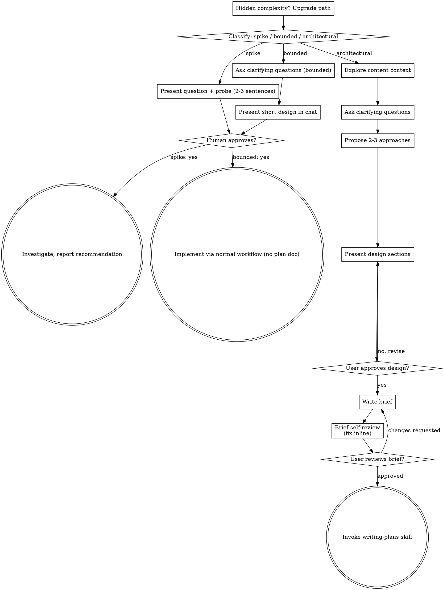

# Brainstorming Biến Ý Tưởng Thành Thiết Kế Content

Giúp bạn biến ý tưởng thành thiết kế content đầy đủ thông qua đối thoại tự nhiên, hợp tác.

Bắt đầu bằng cách phân loại yêu cầu cần bao nhiêu quy trình, sau đó đi
theo đúng path của nó: hiểu bối cảnh, làm rõ ý tưởng, trình bày thiết
kế, và nhận phê duyệt từ bạn.

## Thiết Lập Sự Hiểu Biết Chung

Kết quả của brainstorming là một sự hiểu biết mà bạn có thể nhận ra
và sửa được, bám sát vào điều bạn thực sự muốn đạt được.

1. **Khám phá mục đích.** Dùng yêu cầu và bối cảnh hiện có để xác định
   kết quả mong muốn, bài viết dành cho ai, và thế nào là thành công. Khi
   thiếu thông tin, hỏi một câu hỏi tập trung về mục đích hoặc đối tượng
   dự định trước khi đề xuất góc nhìn hay cách tiếp cận. Biết chủ đề
   không đồng nghĩa biết vì sao bạn muốn làm content đó. Thu thập yêu
   cầu còn thiếu không có nghĩa là yêu cầu bạn phê duyệt lại công việc.
2. **Viết lại sự hiểu biết của mình.** Tóm tắt ngắn gọn kết quả mong
   muốn, các ràng buộc liên quan, và tiêu chí thành công để bạn đánh
   giá. Tách rõ điều bạn đã nói khỏi điều bạn suy đoán. Mời bạn sửa và
   chỉ khi đã tiếp thu câu trả lời thì mới coi đó là content brief.
3. **Mang mục đích vào thiết kế.** Giữ sự hiểu biết đã thống nhất trong
   sản phẩm của path đã chọn: content brief viết ra file cho công việc
   architectural, hoặc thiết kế/thử nghiệm trong chat cho công việc
   bounded và spike. Đối chiếu góc nhìn, outline và lựa chọn format đã
   đề xuất với sự hiểu biết đó.

Khi yêu cầu đã cung cấp đủ mục đích và ràng buộc, hãy phản ánh lại sự
hiểu biết đó thay vì hỏi lại những câu hỏi cũ. Giữ ghi chú ngắn gọn;
độ chính xác của nó và cơ hội để bạn sửa mới là điều quan trọng.

<HARD-GATE>
Trước khi làm bất kỳ hành động triển khai nào, bao gồm gọi skill triển
khai, viết bài, lên dàn ý chi tiết, chuẩn bị tư liệu, hoặc tạo dự án
mới, phải hoàn thành các điều kiện tiên quyết của path đã chọn:

- Spike: bạn phê duyệt câu hỏi và phương án thử.
- Bounded: bạn phê duyệt thiết kế ngắn trong chat.
- Architectural: bạn đọc và phê duyệt content brief đã viết, rồi đọc
  kế hoạch content đã viết và chọn phương thức thực thi. Phê duyệt
  thiết kế bằng lời chỉ cho phép viết brief; phê duyệt brief bằng văn
  bản chỉ cho phép gọi writing-plans.

Một câu trả lời chỉ phê duyệt đúng giai đoạn đã được trình bày. Phê
duyệt ý tưởng hoặc phạm vi không đồng nghĩa phê duyệt những sản phẩm
chưa tồn tại. Quay lại giai đoạn chưa hoàn thành sớm nhất; không biến
một lần phê duyệt thành giấy phép bỏ qua phần còn lại của path. Đọc
tham khảo kho content được phép trong khi các điều kiện tiên quyết vẫn
chưa hoàn thành.
</HARD-GATE>

## Ba Path

Trước câu hỏi đầu tiên, hãy phân loại yêu cầu và nói to phân loại
đó — "yêu cầu này trông giống bounded, nên tôi sẽ trình bày thiết kế
ngắn ngay trong chat thay vì viết brief" — để bạn có thể đổi lại:

- **Spike** — một câu hỏi kiểm chứng nhanh ("có nên...", "test thử
  xem...", "làm nhanh cho biết là được") mà output là một câu trả
  lời/kết luận, không phải bản nháp để giữ lại. Trình bày câu hỏi và
  định thử gì trong 2-3 câu, nhận một cái gật đầu, rồi tìm câu trả lời
  bằng cách rẻ nhất có thể mà vẫn đúng. Không có tài liệu thiết kế,
  không có file brief. Báo cáo kết quả dưới dạng đề xuất; bất cứ thứ
  gì đã làm đều dán nhãn "thử cho biết, không giữ".
- **Bounded** — một bài đơn lẻ: một bài post, một video ngắn, một
  caption. Hỏi các câu hỏi làm rõ cần thiết, trình bày một thiết kế
  ngắn IN CHAT (vài câu đến vài đoạn ngắn: góc nhìn, hook, outline,
  format), và DỪNG. Chỉ bắt đầu triển khai sau khi bạn nói đồng ý
  với thiết kế đó — phê duyệt của một task bounded cũng là một cánh
  cổng cứng như của architectural. Không file brief, không tài liệu
  kế hoạch.
- **Architectural** — series hoặc chiến dịch nhiều bài, thay đổi cấu
  trúc kênh, hoặc bài dài phức tạp (long-form, video dài nhiều phần)
  ảnh hưởng đến các bài khác. Đi quy trình đầy đủ: hỏi, đề xuất các
  hướng, thiết kế theo từng mục, viết brief, rồi gọi skill writing-plans.

Khi phân vân giữa hai path, chọn path nặng hơn. Quy tắc chỉ nâng không
hạ: độ phức tạp ẩn phát hiện giữa chừng sẽ nâng path lên — dừng lại,
nói rõ, và bước lên path cao hơn. Không có chuyện hạ path giữa chừng.

## Anti-Pattern: "Đơn Giản Quá Không Cần Duyệt"

Mọi path đều kết thúc bằng việc bạn phê duyệt thiết kế yêu cầu trước
khi triển khai. Một bài bounded có thể chỉ cần hai câu trong chat. Một
series mới là architectural và bắt buộc phải có brief viết ra file cùng
các bước handoff kế hoạch. Điều chỉnh quy mô sản phẩm theo path đã
chọn; hoàn thành mọi bước duyệt của path đó trước khi triển khai.

## Red Flags

| Suy nghĩ | Thực tế |
|---------|---------|
| "Đơn giản quá, không cần thiết kế" | Đi theo path đã chọn: bài bounded được thiết kế ngắn trong chat; chiến dịch architectural được brief viết ra file và handoff kế hoạch. |
| "Gọi nó là bounded để khỏi viết brief" | Vơ lấy nhãn để né việc CHÍNH là dấu hiệu phân vân — chọn path nặng hơn. |
| "Bài này bounded và thiết kế quá rõ — tôi vừa trình bày vừa làm luôn cho bạn đọc" | Cánh cổng là sự phê duyệt, không phải độ dài thiết kế. Trình bày, rồi dừng cho đến khi nghe "đồng ý". |
| "Tôi hiểu dạng content này, nên nó là bounded" | Bounded đo phạm vi bài viết, không đo độ quen thuộc của bạn. Series mới chưa có bài nào — nó là architectural. |
| "Spike test hook hiệu quả, giữ luôn bản nháp này đăng bài" | Output của spike là câu trả lời. Giữ bản nháp đăng là một yêu cầu mới — phân loại lại. |
| "Nó phình ra rồi, nhưng sắp xong — không cần phân loại lại" | Độ phức tạp ẩn nâng path giữa chừng. Dừng lại và nói rõ. |
| "Bạn đã duyệt spike, nên bài follow-up cũng được duyệt" | Mỗi task có phân loại và phê duyệt riêng. |

## Checklist

Phân loại trước, nói to path, rồi tạo task cho từng mục trong path
và hoàn thành theo thứ tự.

**Spike:**
1. **Khám phá bối cảnh kho content** — đủ để định khung câu hỏi thử
2. **Trình bày câu hỏi + phương án thử** — 2-3 câu
3. **Nhận phê duyệt** — một cái gật đầu là đủ
4. **Thử** — bằng cách rẻ nhất có thể mà vẫn đúng
5. **Báo cáo kết quả** — một đề xuất; dán nhãn "thử cho biết" cho bất cứ thứ gì đã làm

**Bounded:**
1. **Khám phá bối cảnh** — xem bài cũ, brief cũ, bản nháp gần đây
2. **Hỏi câu hỏi làm rõ** — từng câu một, câu nào đáng hỏi
3. **Trình bày thiết kế ngắn trong chat** — góc nhìn, hook, outline, cách kiểm chứng
4. **Nhận phê duyệt** — DỪNG và chờ "đồng ý" rõ ràng; trình bày thiết kế rồi làm luôn trong cùng một hơi là vượt cổng
5. **Triển khai** — đi theo quy trình làm content thông thường (đọc kiểm chứng áp dụng); không tài liệu kế hoạch

**Architectural:**
1. **Khám phá bối cảnh** — xem bài cũ, brief cũ, bản nháp gần đây
2. **Đề xuất visual companion đúng lúc** — KHÔNG đề xuất ngay từ đầu. Lần đầu tiên có một câu hỏi mà nhìn sẽ rõ hơn là kể, hãy đề xuất lúc đó (tin nhắn riêng); khi được đồng ý thì tab trình duyệt mở ra cho bạn. Nếu không bao giờ có câu hỏi cần nhìn, đừng bao giờ đề xuất. Xem mục Visual Companion bên dưới.
3. **Hỏi câu hỏi làm rõ** — từng câu một, hiểu mục đích/ràng buộc/tiêu chí thành công
4. **Đề xuất 2-3 hướng** — kèm trade-off và đề xuất của bạn
5. **Trình bày thiết kế** — theo từng mục, quy mô theo độ phức tạp, xin bạn duyệt sau mỗi mục
6. **Viết brief** — lưu vào `docs/content/briefs/YYYY-MM-DD-<chu-de>-brief.md`
7. **Tự review brief** — kiểm tra nhanh placeholder, mâu thuẫn, mơ hồ, phạm vi (xem bên dưới)
8. **Bạn duyệt brief đã viết** — mời bạn đọc file brief trước khi tiếp tục
9. **Chuyển sang lên kế hoạch** — gọi skill writing-plans để tạo kế hoạch content chi tiết

## Process Flow

**Trạng thái kết thúc gắn với từng path.** Architectural: skill DUY NHẤT
bạn gọi sau brainstorming là writing-plans — không bao giờ gọi skill
triển khai nào khác. Bounded: sau phê duyệt, triển khai đi thẳng theo
quy trình làm content thông thường; không tài liệu kế hoạch. Spike:
trạng thái kết thúc là một đề xuất được báo cáo.

## Quy Trình

Các mục bên dưới phục vụ path bounded và architectural (spike dừng ở
"trình bày phương án thử, nhận cái gật đầu"). Các mục từ **Khám phá
các hướng** trở đi là độ sâu của path architectural — với bài bounded,
bối cảnh cộng vài câu hỏi cộng thiết kế ngắn trong chat là toàn bộ quy
trình.

**Hiểu ý tưởng:**

- Xem tình trạng hiện tại của kho content trước (bài đã đăng, brief cũ, bản nháp gần đây)
- Trước khi hỏi chi tiết, đánh giá phạm vi: nếu yêu cầu mô tả nhiều phần độc lập (ví dụ "làm series gồm bài viết, video, infographic và podcast"), nêu ngay. Đừng tốn câu hỏi làm rõ chi tiết của một chiến dịch cần được tách nhỏ trước.
- Nếu chiến dịch quá lớn cho một brief, giúp bạn tách thành các đợt nhỏ: các phần độc lập là gì, chúng liên quan nhau thế nào, nên làm theo thứ tự nào? Rồi brainstorm đợt đầu tiên theo luồng thiết kế thông thường. Mỗi đợt có chu trình brief → kế hoạch → triển khai riêng.
- Với phạm vi vừa phải, hỏi từng câu một để làm rõ ý tưởng
- Ưu tiên câu hỏi trắc nghiệm khi có thể, câu hỏi mở cũng được
- Mỗi tin nhắn chỉ một câu hỏi - nếu một chủ đề cần đào sâu, tách thành nhiều câu hỏi
- Tập trung vào: mục đích, ràng buộc, tiêu chí thành công

**Khám phá các hướng:**

- Đề xuất 2-3 hướng khác nhau kèm trade-off
- Trình bày các lựa chọn một cách tự nhiên, kèm đề xuất của bạn và lý do
- Bắt đầu bằng hướng bạn đề xuất và giải thích vì sao
- YAGNI một cách tàn nhẫn - loại bỏ mọi thứ không cần thiết khỏi mọi hướng và mọi thiết kế

**Trình bày thiết kế:**

- Khi đã tin rằng mình hiểu cần làm gì, trình bày thiết kế
- Điều chỉnh quy mô mỗi mục theo độ phức tạp: vài câu nếu đơn giản, tối đa 200-300 từ nếu tinh tế
- Hỏi sau mỗi mục xem đã ổn chưa
- Bao quát: góc nhìn, cấu trúc bài, hook, luận điểm chính, cách kiểm chứng (đọc thử, check fact, đọc to thành tiếng)
- Sẵn sàng quay lại làm rõ nếu có gì chưa hợp lý

**Thiết kế để tách biệt và rõ ràng:**

- Tách chiến dịch thành các bài nhỏ, mỗi bài một mục đích rõ ràng, liên kết với nhau qua hook và CTA mạch lạc, có thể hiểu và kiểm chứng độc lập
- Với mỗi bài, bạn phải trả lời được: bài này nói gì, dành cho ai đọc, và nó dựa vào tư liệu nào?
- Có thể hiểu một bài nói gì mà không cần đọc cả series không? Có thể đổi nội dung một bài mà không phá vỡ các bài còn lại không? Nếu không, ranh giới giữa các bài cần làm lại.
- Các bài nhỏ, ranh giới rõ cũng dễ làm hơn với bạn - bạn suy luận tốt hơn về bản nháp mà mình nắm trọn trong bối cảnh, và bản nháp của bạn đáng tin hơn khi mỗi bài tập trung. Khi một bài phình to, đó thường là dấu hiệu nó đang gánh quá nhiều ý.

**Làm việc với kho content hiện có:**

- Khám phá cấu trúc hiện tại trước khi đề xuất. Theo các pattern đã có (tone, format, series đang chạy).
- Khi content cũ có vấn đề ảnh hưởng đến việc đang làm (ví dụ một series bị lệch tone, một bài flop vì hook yếu), đưa cải tiến có mục tiêu vào thiết kế - như một người làm content giỏi vẫn làm khi chạm vào kho content của mình.
- Đừng đề xuất làm lại những thứ không liên quan. Giữ tập trung vào mục tiêu hiện tại.

## Sau Thiết Kế (path architectural)

**Tài liệu:**

- Viết thiết kế đã được xác nhận (brief) vào `docs/content/briefs/YYYY-MM-DD-<chu-de>-brief.md`
  - (Bạn có thể ghi đè vị trí brief mặc định này theo ý mình)
- Dùng skill elements-of-style:writing-clearly-and-concisely nếu có

**Tự Review Brief:**
Sau khi viết brief, nhìn lại nó bằng con mắt mới:

1. **Quét placeholder:** Có "TBD", "TODO", mục chưa xong, hay yêu cầu mơ hồ nào không? Sửa ngay.
2. **Nhất quán nội bộ:** Các mục có mâu thuẫn nhau không? Góc nhìn có khớp với outline các bài không?
3. **Kiểm tra phạm vi:** Đủ tập trung cho một kế hoạch content duy nhất chưa, hay cần tách nhỏ?
4. **Kiểm tra mơ hồ:** Có yêu cầu nào hiểu được theo hai cách không? Nếu có, chọn một và viết rõ.

Sửa mọi vấn đề ngay trong file. Không cần review lại — sửa rồi đi tiếp.

**Cổng Duyệt Của Bạn:**
Sau khi vòng tự review brief xong, mời bạn đọc brief đã viết trước khi tiếp tục:

> "Brief đã viết xong ở `<đường dẫn>`. Bạn đọc giúp mình và cho biết có muốn chỉnh gì không, trước khi mình viết kế hoạch content chi tiết."

Chờ bạn trả lời. Nếu bạn yêu cầu chỉnh, sửa rồi chạy lại vòng tự review brief. Chỉ tiếp tục khi bạn đã phê duyệt.

**Triển khai:**

- Gọi skill writing-plans để tạo kế hoạch content chi tiết
- KHÔNG gọi bất kỳ skill nào khác. writing-plans là bước tiếp theo.

## Visual Companion

Một công cụ trên trình duyệt để hiển thị mockup, sơ đồ và các lựa chọn
trực quan trong lúc brainstorming. Đây là công cụ — không phải chế độ.
Đồng ý dùng companion nghĩa là nó sẵn sàng cho những câu hỏi cần nhìn
mới rõ; KHÔNG có nghĩa mọi câu hỏi đều đi qua trình duyệt.

**Đề xuất companion (đúng lúc):** KHÔNG đề xuất ngay từ đầu. Chờ đến khi
có một câu hỏi mà nhìn sẽ rõ hơn là kể — một câu hỏi thực sự về thumbnail
/ layout / storyboard, không chỉ là chủ đề *liên quan đến* hình ảnh. Lần
đầu tiên điều đó xảy ra, đề xuất ngay lúc đó, trong một tin nhắn riêng:
> "Phần này nhìn sẽ dễ hình dung hơn là kể — mình có thể dựng thumbnail, layout bài đăng và storyboard so sánh trong một tab trình duyệt cho bạn xem dần. Nó còn mới và có thể tốn token. Bạn muốn thử không? Mình sẽ mở cho bạn."

**Lời đề xuất này PHẢI là một tin nhắn riêng.** Chỉ có lời đề xuất — không
kèm câu hỏi làm rõ, tóm tắt hay nội dung gì khác. Chờ bạn trả lời. Nếu bạn
đồng ý, khởi động server với `--open` để trình duyệt của bạn tự mở màn
hình đầu tiên. Nếu bạn từ chối, tiếp tục chỉ bằng chữ và đừng đề xuất lại
trừ khi bạn nhắc đến.

**Quyết định theo từng câu hỏi:** Ngay cả sau khi bạn đã đồng ý, hãy
quyết định CHO TỪNG CÂU HỎI xem dùng trình duyệt hay terminal. Bài kiểm
tra: **bạn hiểu rõ hơn khi NHÌN hay khi ĐỌC?**

- **Dùng trình duyệt** cho nội dung VỐN là hình ảnh — so sánh thumbnail, layout bài đăng, storyboard, sơ đồ luồng series, thiết kế trực quan đặt cạnh nhau
- **Dùng terminal** cho nội dung là chữ — câu hỏi về yêu cầu, lựa chọn khái niệm, liệt kê trade-off, các lựa chọn A/B/C/D bằng chữ, quyết định phạm vi

Một câu hỏi về chủ đề hình ảnh không tự động thành câu hỏi cần nhìn.
"Thumbnail này truyền tải cảm xúc gì?" là câu hỏi khái niệm — dùng
terminal. "Layout nào hợp với bài này hơn?" là câu hỏi cần nhìn — dùng
trình duyệt.

Nếu bạn đồng ý dùng companion, đọc kỹ hướng dẫn chi tiết trước khi tiếp tục:
`skills/brainstorming/visual-companion.md`
