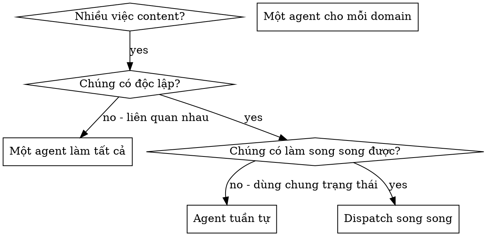

# Dispatch các Agent Song Song

## Tổng quan

Bạn giao việc cho các agent chuyên biệt với context tách biệt. Bằng cách soạn chính xác hướng dẫn và context cho chúng, bạn đảm bảo chúng tập trung và làm tốt task. Chúng không bao giờ thừa hưởng context hay lịch sử phiên của bạn — bạn tự xây dựng đúng những gì chúng cần. Việc này cũng giữ context của chính bạn dành cho công việc điều phối.

Khi bạn có nhiều việc content không liên quan (research các chủ đề khác nhau, viết các bài khác nhau, sửa các bản nháp khác nhau), làm tuần tự từng việc một tốn thời gian. Mỗi việc độc lập và có thể diễn ra song song.

**Nguyên tắc cốt lõi:** Dispatch một agent cho mỗi domain vấn đề độc lập. Để chúng làm đồng thời.

## Khi nào dùng



**Dùng khi:**
- 2+ việc độc lập không phụ thuộc nhau — ví dụ cùng lúc research 3 chủ đề khác nhau, hoặc 1 agent viết bài A + 1 agent viết bài B + 1 agent edit bài C đã xong
- Mỗi việc có thể hiểu được mà không cần context từ việc khác
- Không có trạng thái chung giữa các việc

**KHÔNG dùng khi:**
- Các việc liên quan nhau (sửa hook bài A ảnh hưởng outline bài B)
- Cần nắm toàn cảnh mới làm được
- Các agent sẽ giẫm chân nhau (cùng sửa 1 file)

## Pattern

### 1. Xác định các domain độc lập

Nhóm việc theo phạm vi:
- Research chủ đề A: thói quen đọc của Gen Z
- Research chủ đề B: xu hướng video ngắn 2026
- Research chủ đề C: thuật toán Facebook mới nhất

Mỗi domain độc lập — research chủ đề A không ảnh hưởng gì tới chủ đề B.

### 2. Viết task tập trung cho mỗi agent

Mỗi agent nhận:
- **Phạm vi cụ thể:** Một chủ đề, một bài, một bản nháp
- **Mục tiêu rõ:** Bài viết xong / research xong với tiêu chí cụ thể
- **Ràng buộc:** "Không đụng vào X" — ví dụ không sửa file của bài khác
- **Output kỳ vọng:** Tóm tắt đã làm gì

### 3. Dispatch TẤT CẢ trong cùng một lượt

Phát tất cả các lệnh dispatch subagent trong cùng một response — chúng chạy song song:

```text
Subagent (general-purpose): "Research 5 số liệu về thói quen đọc của Gen Z kèm nguồn"
Subagent (general-purpose): "Research 5 số liệu về xu hướng video ngắn 2026 kèm nguồn"
Subagent (general-purpose): "Research 5 số liệu về thuật toán Facebook mới nhất kèm nguồn"
# Cả ba chạy đồng thời.
```

Nhiều lệnh dispatch trong một response = thực thi song song. Một lệnh một response = tuần tự.

### 4. Review & tích hợp

Khi các agent trả về:
- Đọc tóm tắt từng agent
- Kiểm tra xung đột giữa các kết quả
- Đọc kiểm chứng toàn bộ nội dung đã tích hợp

## Cấu trúc Prompt cho Agent

Prompt tốt cho agent cần:
1. **Tập trung** — Một domain vấn đề rõ ràng
2. **Tự chứa** — Đủ mọi context cần để hiểu vấn đề
3. **Cụ thể về output** — Agent nên trả về cái gì?

Ví dụ prompt tốt:

```markdown
Research 5 số liệu về thói quen đọc của Gen Z kèm nguồn, trả về dạng bullet có link nguồn.

Yêu cầu:
1. Số liệu phải từ năm 2024 trở lại đây
2. Ưu tiên nguồn uy tín (báo lớn, tổ chức nghiên cứu)
3. Mỗi số liệu một dòng: số liệu — nguồn (link)

KHÔNG viết bài, chỉ research.
```

Ví dụ prompt tệ:

```markdown
Research về Gen Z đi.
```

Prompt tệ quá rộng, thiếu context, thiếu ràng buộc, output mơ hồ.

## Các lỗi thường gặp

**❌ Quá rộng:** "Viết hết các bài content đi" — agent lạc lối
**✅ Cụ thể:** "Viết bài A theo brief trong file brief-a.md" — phạm vi tập trung

**❌ Thiếu context:** "Sửa bài cho hay hơn" — agent không biết "hay" theo chuẩn nào
**✅ Có context:** Dán brief, tone of voice, và đối tượng độc giả vào prompt

**❌ Thiếu ràng buộc:** Agent có thể viết lại toàn bộ bài theo ý mình
**✅ Có ràng buộc:** "Chỉ sửa hook và CTA" hoặc "Không đổi cấu trúc bài, chỉ gọt câu"

**❌ Output mơ hồ:** "Làm đi" — bạn không biết nó đã đổi gì
**✅ Cụ thể:** "Trả về tóm tắt: đã đổi những đoạn nào và vì sao"

## Khi KHÔNG dùng

**Các việc liên quan nhau:** Sửa hook bài A ảnh hưởng outline bài B — làm chung trước
**Cần nắm toàn cảnh:** Hiểu được chỉ khi thấy cả series
**Còn đang mò mẫm:** Bạn chưa biết vấn đề nằm ở đâu
**Dùng chung trạng thái:** Các agent sẽ giẫm chân nhau (cùng sửa một file, cùng dùng một tài nguyên)

## Ví dụ thực tế từ phiên làm việc

**Tình huống:** Cần chuẩn bị tư liệu cho 3 bài trong series, mỗi bài một chủ đề khác nhau

**Các việc:**
- Research chủ đề A: 5 số liệu về thói quen đọc của Gen Z
- Research chủ đề B: 5 số liệu về xu hướng video ngắn 2026
- Research chủ đề C: 5 số liệu về thuật toán Facebook mới nhất

**Quyết định:** Domain độc lập — research chủ đề này không ảnh hưởng chủ đề kia

**Dispatch:**
```
Agent 1 → Research chủ đề A (thói quen đọc Gen Z)
Agent 2 → Research chủ đề B (xu hướng video ngắn 2026)
Agent 3 → Research chủ đề C (thuật toán Facebook)
```

**Kết quả:**
- Agent 1: 5 số liệu kèm link nguồn uy tín
- Agent 2: 5 số liệu kèm link nguồn uy tín
- Agent 3: 5 số liệu kèm link nguồn uy tín

**Tích hợp:** Các kết quả độc lập, không xung đột, gộp vào kho tư liệu chung của series

## Kiểm chứng

Sau khi các agent trả về:
1. **Đọc tóm tắt từng agent** — Hiểu cái gì đã đổi
2. **Kiểm tra xung đột** — Các agent có sửa cùng một file không?
3. **Đọc kiểm chứng toàn bộ** — Đọc thử mọi nội dung đã tích hợp, check fact lại các số liệu
4. **Spot check** — Agent có thể mắc lỗi hệ thống, đọc lướt vài đoạn để bắt lỗi
