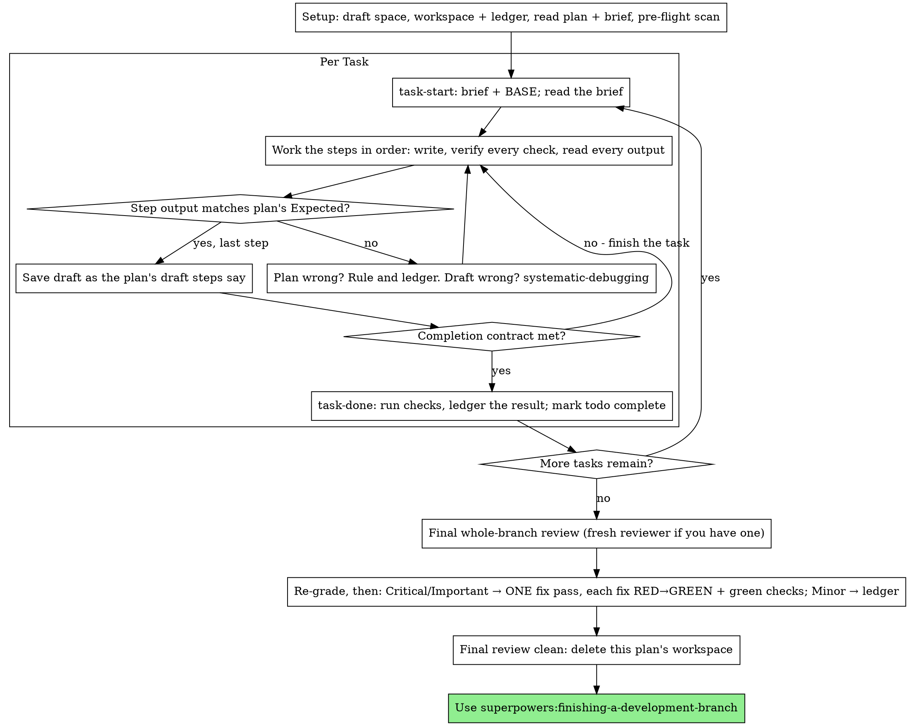

# Thực Thi Kế Hoạch Content

Tự thực thi kế hoạch, task by task, trong phiên này: không subagent
thực thi cho từng task, không reviewer cho từng task. Một lần review
bằng context mới cho toàn bộ ở cuối.

**Vì sao inline:** Subagent-driven development trả giá bằng một người
thực thi mới và một reviewer mới cho mỗi task, mỗi người đọc lại kho
content từ con số không. Thực thi inline trả giá bằng một context (của
bạn) cộng một reviewer ở cuối. Cái phải đánh đổi là context mới cho mỗi
task và một cặp mắt thứ hai cho mỗi task. Skill này giữ lại những gì hai
thứ đó mang lại, bằng cách khác: brief là content brief, ledger là trí
nhớ của bạn, đọc kiểm chứng là cổng kiểm tra cho mỗi task, và reviewer
cuối cùng là cặp mắt thứ hai.

**Nguyên tắc cốt lõi:** Kế hoạch đã nghĩ hộ. Việc của bạn là thực thi
chính xác, chứng minh mỗi step bằng lần kiểm chứng bạn đã thực hiện và
đọc kết quả, và để lại bản ghi vượt qua cả sự quên của chính bạn.

**Narration:** giữa các tool call, kể tối đa một dòng ngắn — ledger và
kết quả tool đã gánh phần ghi chép.

**Thực thi liên tục:** Không dừng lại hỏi bạn giữa các task. Bạn chọn
thực thi inline để đỡ tốn kém, không phải để trả lời "làm tiếp không?"
sau mỗi task. Thực thi mọi task trong kế hoạch không dừng giữa chừng.

**Rulings, not stalls.** Xung đột, mơ hồ, lỗi kế hoạch — bạn quyết. Brief
là thẩm quyền ràng buộc, kế hoạch là lập luận từ brief, và phán đoán của
bạn chốt những gì cả hai không trả lời. Ghi mọi quyết định vào ledger
dạng `Ruling: <quyết định> — <vì sao> — <giá nếu sai>`, rồi làm tiếp.
Lệch khỏi kế hoạch mà không có ruling trong ledger là quyết định đưa ra
trong bí mật.

Bốn điều duy nhất được dừng, và chỉ bốn điều này: một hành động không
thể hoàn tác hoặc có tính phá hoại; một hành động nhạy cảm bảo mật; một
tác dụng phụ ngoài không gian nháp này mà theo thông lệ phải hỏi trước
(ĐĂNG BÀI lên kênh công khai, gửi bản nháp cho người ngoài, xuất bản);
và một kế hoạch hỏng đến mức mọi đường đi tiếp đều là đoán mò. Gặp
những điều đó, dừng lại và hỏi.

## Khi Nào Dùng

- Bạn có kế hoạch từ superpowers:writing-plans và bạn đã chọn thực thi
  inline ở bước bàn giao.
- Nền tảng của bạn không có subagent tool (xem các file tham chiếu theo
  nền tảng trong `../using-superpowers/references/`). Không bao giờ bịa
  ra một lần điều phối; chạy kế hoạch ngay tại đây.
- Các task phần lớn độc lập — cùng điều kiện tiên quyết như
  superpowers:subagent-driven-development.

Một kế hoạch đầy đủ chi tiết biến thực thi inline thành chép lại cộng
kiểm chứng: nó chạy tốt trên model phiên tầm trung, và chỗ duy nhất mà
model mạnh nhất xứng đáng với chi phí là lần review cuối, skill này sẽ
điều phối riêng. Nói cho bạn biết điều đó khi bạn chọn inline.

Ưu tiên superpowers:subagent-driven-development khi bạn muốn cổng review
cho mỗi task, hoặc khi kế hoạch dài đến mức các task cuối sẽ chạy trên
context đã bị nén. Thực thi inline trên kế hoạch dài vẫn được — ledger
là thứ giúp nó khôi phục được — nhưng các task cuối nhận được ít "bạn"
nhất.

## Quy Trình



## Setup

Đảm bảo công việc diễn ra trong không gian nháp cô lập: dùng
superpowers:using-git-worktrees để tạo mới hoặc xác nhận không gian
hiện có. Không bao giờ bắt đầu viết trên nhánh main/master khi chưa có
sự đồng ý rõ ràng của bạn.

Trí nhớ đối thoại không sống sót qua compaction. Một người thực thi
inline mất dấu sẽ viết lại các task mà bản nháp đã lưu — cùng một lỗi
như controller điều phối trùng, trả giá bằng chính context của bạn.
Theo dõi tiến độ trong file ledger, không chỉ trong todos. Todos của
nền tảng là khung nhìn trực tiếp; ledger mới là bản ghi.

Workspace và ledger dùng chung với superpowers:subagent-driven-development
— cùng thư mục, cùng format — để một kế hoạch có thể đổi người thực thi
giữa chừng và người mới tiếp tục từ cùng một ledger.

- Mỗi kế hoạch sở hữu một workspace: lúc bắt đầu skill, chạy
  `../subagent-driven-development/scripts/sdd-workspace PLAN_FILE` — nó
  in ra thư mục git-ignored của kế hoạch
  (`<repo-root>/.content/sdd/<plan-basename>/`), nơi chứa mọi sản phẩm
  của RIÊNG kế hoạch này: ledger, brief, gói review. Thư mục của kế
  hoạch khác không bao giờ là của bạn để đọc hay viết.
- Kiểm tra ledger của kế hoạch này ở `<workspace>/progress.md`. Nếu dòng
  đầu tiên ghi tên file kế hoạch của bạn, các task có dòng
  `Task <N>: complete` là XONG — không làm lại; tiếp tục từ task đầu
  tiên chưa có dòng đó. Các bản nháp đã lưu tồn tại trong git ngay cả khi
  context của bạn không còn nhớ đã lưu: sau compaction, tin ledger và
  `git log` hơn tin trí nhớ của mình. Ledger mà dòng đầu ghi tên file kế
  hoạch khác là tiến độ của kế hoạch khác: để yên và bắt đầu ledger mới
  của mình.
- Tạo ledger với dòng định danh đầu tiên:
  `# SDD ledger — plan: <đường dẫn file kế hoạch>`.
- `git clean -fdx` sẽ phá hủy workspace (nó là scratch git-ignored);
  nếu chuyện đó xảy ra, khôi phục từ `git log`.

Đọc kế hoạch một lần, ghi nhận bối cảnh và Ràng Buộc Chung, tạo một todo
cho mỗi task. Nếu kế hoạch nêu một Brief, đọc luôn: brief là thẩm quyền
mà kế hoạch lập luận từ đó, và xung đột bên trong kế hoạch được giải
quyết theo brief. Kế hoạch không có brief đọc được thì ghi một dòng vào
ledger — các ruling đưa ra khi đó chỉ là tạm thời.

Trước Task 1, quét kế hoạch tìm xung đột giữa các task. Block Kế thừa
của kế hoạch cho biết nhìn ở đâu: với mỗi task dùng thứ task trước để
lại, một dòng ledger — hai task, thứ task trước để lại đối chiếu với thứ
task này dùng, và bạn phát hiện gì. Các task không dùng chung gì thì
không có dòng; kế hoạch mà các task chẳng dùng chung gì thì chỉ một dòng
`Pre-flight: no shared interfaces`. Quyết (rule) từng xung đột mà dòng
nào nêu ra, lấy brief làm thẩm quyền ràng buộc, ghi ruling cạnh dòng
đó, rồi bắt đầu Task 1. Văn bản của từng task được kiểm khi bạn đọc
brief của nó, không phải ở đây.

## Vòng Lặp Task

Mọi thứ bạn in ra, và mọi kết quả tool, đều ở lại trong context của bạn
đến hết phiên. Chuyển output kiểm chứng dài ra file trong workspace rồi
đọc phần đuôi; đọc brief, không đọc cả kế hoạch.

### 1. Nhận task

- Chạy `scripts/task-start PLAN_FILE N` của skill này. Nó in đường dẫn
  brief và BASE (bản nháp mà phạm vi review của task được cắt từ đó)
  trong một lần gọi. Đọc brief của mọi task, kể cả task bạn nhớ từ lúc
  setup: cái bạn nhớ là tóm tắt, brief mới có giá trị chính xác, hook,
  CTA và tiêu chí kiểm chứng.
- Đánh dấu todo của task là in_progress.

Mỗi tool call là một turn đọc lại toàn bộ context của bạn. Ghi chép sổ
sách đi ké với công việc — một lần append ledger trong cùng call với
lưu bản nháp, không bao giờ trong call riêng.

### 2. Làm các step

Các step của kế hoạch đã xếp theo thứ tự viết-trước-kiểm-chứng-sau; làm
đúng thứ tự đó. Step kiểm chứng được viết trước và chạy trước. Đọc kỹ
kết quả kiểm chứng là một step, không phải thủ tục cho có — một lần
kiểm chứng "đạt" trước khi bản nháp tồn tại là một phát hiện về chính
cách kiểm chứng đó.

Mỗi step chạy kiểm chứng đều có dòng `Expected:`. Chạy kiểm chứng, đọc
output, và đối chiếu. Ba kết quả:

- **Khớp.** Sang step tiếp.
- **Bản nháp sai.** Dùng superpowers:systematic-debugging. Tìm nguyên
  nhân; không bao giờ vá triệu chứng cho output khớp với step.
- **Kế hoạch sai** — step mâu thuẫn với brief, thứ task trước để lại
  không khớp với thứ task này dùng, câu lệnh kiểm chứng không thể chạy
  được. Quyết thay đổi nhỏ nhất thỏa brief, ghi vào ledger dạng
  `Task <N>: Ruling: <phát hiện> — <quyết định và vì sao>`, rồi làm tiếp.
  Ruling được mang theo, không phải nhớ trong đầu: các task sau chạm vào
  cùng chỗ đó đọc ruling từ ledger.

Lưu bản nháp theo đúng step lưu bản nháp của kế hoạch. Một task trải
qua nhiều lần lưu là bình thường; BASE là thứ phạm vi review được cắt
từ đó, không bao giờ là `HEAD~1`.

### 3. Hợp đồng hoàn thành

Trước dòng ledger của một task, tất cả những điều sau phải đúng, với
bằng chứng trong phiên này — không suy từ "nhìn diff có vẻ ổn":

- Mọi kiểm chứng brief nêu tên đều tồn tại và đã chạy trong task này, và bạn đã đọc output.
- Lần kiểm chứng cuối cùng của task đạt — `task-done` chính là lần chạy đó, và nó ghi câu lệnh cùng kết quả vào dòng ledger.
- Mọi dòng `Expected:` trong brief đã được đối chiếu với output thật.
- Mọi lệch khỏi brief đều có dòng `Ruling:` trong ledger.

**SUB-SKILL BẮT BUỘC:** superpowers:verification-before-completion chi
phối lời tuyên bố hoàn thành. Thiếu mục nào, task chưa xong: làm nốt.

### 4. Hoàn thành task

Chạy `scripts/task-done PLAN_FILE N BASE -- <lệnh kiểm chứng>` của skill
này với lệnh kiểm chứng brief nêu cho toàn task. Nó chạy các kiểm chứng,
giữ toàn bộ output trong workspace, in phần đuôi, và — chỉ khi đạt —
append dòng hoàn thành vào ledger:

`Task <N>: complete (drafts <base7>..<head7>, checks: <lệnh> → <kết quả>)`

Lần chạy hỏng không ghi gì; task chưa hoàn thành. Khi đã ghi, đánh dấu
todo hoàn thành và nhận task tiếp theo.

## Review Cuối

Chạy `../subagent-driven-development/scripts/review-package PLAN_FILE MERGE_BASE HEAD`
(MERGE_BASE = bản nháp mà nhánh bắt đầu từ đó, ví dụ
`git merge-base main HEAD`) và review từ file nó in ra.

**Khi có subagent tool:** điều phối reviewer trên model mạnh nhất có thể —
review toàn bộ là task phán đoán — dùng
[code-reviewer.md](../requesting-code-review/code-reviewer.md) của
superpowers:requesting-code-review, kèm đường dẫn gói review, đường dẫn
kế hoạch và brief, mục Điểm Rủi Ro của kế hoạch nguyên văn nếu có (các
loại input và chế độ lỗi mà kiểm chứng của kế hoạch không bao phủ —
reviewer kiểm tra từng cái một cách chủ động), và trỏ tới các dòng
`Ruling:` trong ledger để reviewer cân nhắc các quyết định bạn đã đưa.
Chỉ định model rõ ràng; bỏ trống model là kế thừa model của phiên, có
thể không phải model mạnh nhất. Đây là context mới duy nhất cả lần chạy
này mua được. Đừng bỏ qua, và đừng thay bằng việc tự bạn đọc diff.

**Khi không có subagent tool:** đọc code-reviewer.md và tự thực hiện
review đó với gói review, như một lượt riêng sau dòng ledger của task
cuối. Ghi `Final review: self-review (no subagent tool)` vào ledger, và
nói rõ trong tin nhắn cuối: tự review của tác giả yếu hơn reviewer mới,
và bạn là người quyết xem thế có đủ trước khi đăng bài không.

Sắp xếp các phát hiện trước khi hành động với bất kỳ cái nào. Nhãn mức
độ của reviewer chỉ là lời khuyên; cánh cổng là của bạn. Danh sách
"Declined to judge" của nó cũng là của bạn: mỗi dòng ở đó là một ruling
bạn đưa ra và ghi ledger, y hệt xung đột kế hoạch —
`Final: Ruling: <hành vi reviewer bỏ qua> — <người đọc bình thường nhận
được gì, và vì sao giữ nguyên hay vì sao giờ nó thành phát hiện> — <giá
nếu sai>`. Chấm lại điểm trước, theo tác động: brief là tài liệu tầm
nhìn, và điểm của một phát hiện là thứ người đọc bình thường nhận được
nếu đăng bài, không phải brief có nêu input gây ra nó không — reviewer
chấm Minor vì brief im lặng là đang chấm brief, không phải chấm tác
động. Rồi:

- **Critical và Important** vào lượt fix.
- **Minor** vào ledger dạng `Final: minor (deferred): <một dòng>`
  và vào tin nhắn cuối dưới mục "Deferred minors". Minor không bao giờ
  vào lượt fix, không bao giờ thành ruling — ruling là quyết định về một
  xung đột, không phải ghi chú rằng bạn bỏ qua một gợi ý trau chuốt.

Tự fix các phát hiện Critical và Important — bạn là người thực thi ở đây —
trong MỘT lượt. Mỗi fix được kiểm chứng bằng cách đọc kiểm chứng, không
bằng reviewer thứ hai: viết cách kiểm chứng tái hiện phát hiện, thấy nó
hỏng trước, sửa cho đạt, rồi chạy toàn bộ kiểm chứng. Ghi mỗi cái vào
ledger dạng `Final: fixed <phát hiện> — <tên kiểm chứng> RED→GREEN,
checks <N>/<N>`. Fix mà không có kiểm chứng hỏng trước thì chưa được
kiểm chứng; kiểm chứng toàn bộ chưa xanh sau lượt fix nghĩa là lượt fix
chưa xong. Không điều phối review lại: nó sẽ đọc lại một diff mà các
kiểm chứng bao phủ đã trả lời "đã xử lý" và lần chạy kiểm chứng toàn bộ
đã trả lời "không phá gì".

Phát hiện nào bạn quyết không fix là một ruling —
`Final: Ruling: <phát hiện> — <vì sao giữ nguyên> — <giá nếu sai>` — và
đến tay bạn trong danh sách rulings. Không có lượt fix thứ hai.

## Kết Thúc

Trước khi xóa bất cứ thứ gì, gom mọi dòng ledger chứa `Ruling:` vào tin
nhắn cuối dưới mục "Rulings I made", theo đúng thứ tự bạn đưa ra, mỗi
cái kèm giá nếu sai, và mọi dòng `minor (deferred)` dưới mục "Deferred
minors". Cả hai danh sách đều đầy đủ. Tin nhắn cuối của bạn là nơi duy
nhất những quyết định bạn đưa thay bạn — và những phát hiện bạn chọn
không hành động — đến được với bạn.

Khi review cuối sạch và các fix đã lưu bản nháp, xóa thư mục workspace
của kế hoạch này — lịch sử git giờ là bản ghi. Thư mục của kế hoạch
khác là của người khác; để yên.

Dùng superpowers:finishing-a-development-branch.

## Những Lời Biện Minh Thường Gặp

| Lời bào chữa | Thực tế |
|--------|---------|
| "Tôi nhớ Task N nói gì" | Bạn nhớ tóm tắt. Brief có giá trị chính xác. Đọc nó. |
| "Bản nháp đúng rồi, khỏi cần đọc kiểm chứng lại" | Lần kiểm chứng bạn chưa từng đọc kỹ chứng minh được gì. Nó là một step. Chạy nó. |
| "Tôi chạy kiểm chứng toàn bộ ở cuối thay vì từng step" | Chạy từng step mới biết step nào làm hỏng. Lần chạy cuối task là hợp đồng, không thay thế được. |
| "Kế hoạch sai chỗ này, tôi cứ làm đúng là được" | Làm đúng và ghi ruling vào ledger. Lệch không ghi ledger là quyết định đưa ra trong bí mật. |
| "Tôi ghi ledger sau vài task" | Compaction không chờ lúc thuận tiện. Một dòng cho mỗi task, trong cùng tin nhắn với lưu bản nháp. |
| "Để tôi hỏi bạn trước khi sang task tiếp" | Bạn chọn inline để đỡ tốn kém. Hỏi tiến độ tốn thời gian của bạn. Chỉ bốn điểm dừng mới được dừng. |
| "Tôi tự đọc diff kỹ rồi; reviewer cuối là thừa" | Cùng tác giả, cùng điểm mù. Reviewer là context mới duy nhất lần chạy này mua được. |
| "Kiểm chứng chắc đạt, bài này đơn giản mà" | "Chắc" không phải bằng chứng. Hợp đồng yêu cầu câu lệnh và output. |
| "Subagent chậm và đắt, tôi bỏ luôn review cuối" | Inline đã bỏ reviewer từng task. Một lần review toàn bộ là mức sàn, không phải mức trần. |
| "Reviewer chấm Minor thì nó là Minor" | Nhãn đó chấm sự im lặng của brief. Chấm thứ người đọc nhận được. Chấm lại điểm, rồi mới qua cổng. |
| "Fix này rõ quá, khỏi cần kiểm chứng hỏng trước" | Kiểm chứng hỏng trước là bằng chứng duy nhất rằng phát hiện có thật và giờ đã hết. Không có nó bạn chỉ có diff và hy vọng. |
| "Tôi fix luôn minor cho tiện" | Mỗi minor bạn fix là một kiểm chứng, một fix và một lần chạy mà bạn không hề yêu cầu. Ghi ledger; bạn quyết. |

## Ví Dụ Quy Trình

```
Bạn: Mình đang dùng skill executing-plans để thực thi kế hoạch này inline.

[Setup: không gian nháp đã xác nhận]
[Đọc kế hoạch một lần: docs/content/plans/chien-dich-plan.md; brief đã đọc]
[Resolve workspace: sdd-workspace docs/content/plans/chien-dich-plan.md — chưa có ledger, bắt đầu mới]
[Pre-flight scan: 2 dòng kế thừa chung, 4 dòng tự nhất quán, sạch; đã ghi ledger]
[Tạo todos cho mọi task]

Task 1: Bài mở màn series

[task-start plan 1 → brief đã đọc; BASE a1b2c3d]
[Step 1: viết hook + luận điểm — xong]
[Step 2: kiểm chứng hook — đọc to vấp ở câu 2, sửa lại. Khớp Expected.]
[Step 3: viết bản nháp — xong]
[Step 4: đọc kiểm chứng — PASS: đọc to trôi, fact có nguồn, chính tả sạch. Khớp Expected.]
[Step 5: lưu bản nháp — d4e5f6a]
[Contract: kiểm chứng đã chạy, output đã đọc, không lệch]
[task-done plan 1 a1b2c3d -- doc-kiem-chung → ledger: Task 1: complete (drafts a1b2c3d..d4e5f6a, checks: doc-kiem-chung → đạt)]

Task 2: Bài đào sâu

[task-start plan 2 → brief đã đọc; BASE d4e5f6a]
[Step 2: kiểm chứng hook — hook Task 1 chốt "3 sai lầm", brief Task 2 ghi "5 sai lầm"]
[Ruling: brief Task 2 ghi sai số so với Kế thừa của Task 1; dùng "3 sai lầm" — Ledger: Task 2: Ruling: "5 sai lầm" → "3 sai lầm" — khớp Kế thừa Task 1 — giá nếu sai: một lần sửa hook]
[Steps 2-5 như kế hoạch; lưu bản nháp b7c8d9e]
[task-done plan 2 d4e5f6a -- doc-kiem-chung → ledger: Task 2: complete (drafts d4e5f6a..b7c8d9e, checks: doc-kiem-chung → đạt)]

...

[Sau mọi task: review-package plan MERGE_BASE HEAD; điều phối code-reviewer, model mạnh nhất]
Reviewer: Một phát hiện Important — CTA mỗi bài khác nhau, thiếu nhất quán. Hai Minor.
[Chấm lại: Important giữ nguyên; minor → ledger dạng deferred]
[Fix pass: kiểm chứng cta_nhat_quan RED → thống nhất CTA → GREEN; checks 12/12; lưu bản nháp]
[Ledger: Final: fixed CTA không nhất quán — cta_nhat_quan RED→GREEN, checks 12/12]

Rulings I made:
- Task 2: "5 sai lầm" → "3 sai lầm" (brief ghi sai so với Kế thừa Task 1; giá nếu sai: một lần sửa hook)

Deferred minors:
- Bài 1 thiếu ví dụ minh họa cụ thể
- Bài 2 có thể tách phần mở bài thành bài riêng

[Xóa workspace của kế hoạch này — bản ghi giờ nằm trong git]

Dùng superpowers:finishing-a-development-branch.
```
