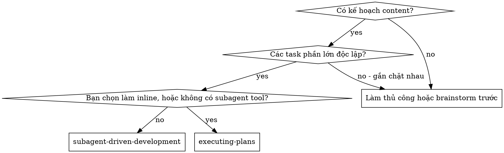
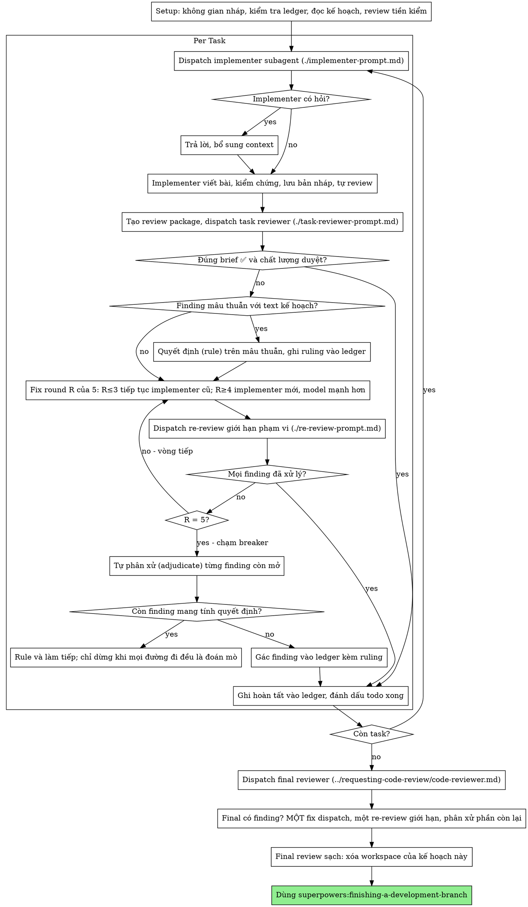

# Phát triển Content bằng Subagent

Thực thi kế hoạch content bằng cách giao mỗi task cho một subagent implementer mới, review task sau mỗi lần (đúng brief + chất lượng bài), và một review tổng toàn bộ khi kết thúc.

**Vì sao dùng subagent:** Bạn giao task cho các agent chuyên biệt với context tách biệt. Bằng cách soạn chính xác hướng dẫn và context cho chúng, bạn đảm bảo chúng tập trung và làm tốt task. Chúng không bao giờ thừa hưởng context hay lịch sử phiên của bạn — bạn tự xây dựng đúng những gì chúng cần. Việc này cũng giữ context của chính bạn dành cho công việc điều phối.

**Nguyên tắc cốt lõi:** Subagent mới cho mỗi task + review sau mỗi task (đúng brief + chất lượng) + review tổng cuối cùng = chất lượng cao, lặp nhanh

**Narration:** giữa các tool call, chỉ narrate tối đa một dòng ngắn — ledger và kết quả tool đã mang đủ bản ghi.

**Thực thi liên tục:** Không dừng lại hỏi ý người cộng tác giữa các task. Thực thi toàn bộ task của kế hoạch không ngừng. Lý do duy nhất để dừng là 4 điều được nêu dưới đây, hoặc mọi task đã xong. Các câu hỏi kiểu "Có làm tiếp không?" hay tóm tắt tiến độ giữa chừng chỉ tốn thời gian của họ — họ đã bảo bạn thực thi kế hoạch, vậy hãy thực thi.

**Quyết định, không chần chừ (Rulings, not stalls).** Một kế hoạch đang chạy không chờ con người. Xung đột, mập mờ, khiếm khuyết trong kế hoạch, giới hạn mà lẽ ra bạn phải hỏi để vượt — hãy tự quyết. Brief là căn cứ có hiệu lực ràng buộc, kế hoạch là luận chứng từ brief, và phán đoán của bạn giải quyết những gì cả hai không trả lời được. Ghi mọi quyết định vào ledger dưới dạng `Ruling: <bạn đã quyết gì> — <vì sao> — <sai thì tốn gì>`, rồi làm tiếp. Một ruling sai chỉ tốn công làm lại mà người cộng tác nhìn thấy và sửa được; một phiên treo vì câu hỏi tốn cả ngày của họ mà chẳng được gì.

Chỉ có 4 điều được dừng, và chỉ 4 điều đó: một thao tác không thể hoàn tác hoặc mang tính hủy hoại; một hành động nhạy cảm bảo mật; một tác dụng phụ nằm ngoài không gian làm việc này mà thông lệ là phải hỏi trước (đăng bài công khai, xóa nội dung chung, xuất bản lên kênh chung); và một kế hoạch hỏng đến mức mọi đường đi đều là đoán mò. Với những trường hợp đó, dừng lại và hỏi.

## Khi nào dùng



**vs. Executing Plans (inline):**
- Subagent mới cho mỗi task (không ô nhiễm context) thay vì một context làm mọi task
- Review sau mỗi task (đúng brief + chất lượng bài) thay vì chỉ review cuối
- Tốn một context mới cho mỗi task và mỗi review; làm inline chỉ tốn một context cộng một reviewer cuối
- Cả hai đều chạy trong phiên này, chia sẻ cùng workspace và ledger của kế hoạch, và không bao giờ dừng giữa các task

## Quy trình



## Setup

Đảm bảo công việc diễn ra trong một workspace cô lập: dùng
superpowers:using-git-worktrees để tạo mới hoặc xác minh cái đang có.
Không bao giờ bắt đầu triển khai trên không gian chung/nền chung mà không
có sự đồng ý rõ ràng của người cộng tác.

Memory của cuộc trò chuyện không sống sót qua compaction. Trong các phiên
thực tế, những controller mất dấu vị trí đã dispatch lại toàn bộ chuỗi
task đã xong — đó là thất bại tốn kém nhất từng quan sát được. Theo dõi
tiến độ trong một file ledger, không chỉ trong todos.

- Mỗi kế hoạch sở hữu một workspace: khi bắt đầu skill, chạy
  `bash scripts/sdd-workspace PLAN_FILE` của skill này — nó in ra thư mục
  git-ignored của kế hoạch (dưới `<repo-root>/.superpowers/sdd/`), nơi
  chứa mọi artifact của RIÊNG kế hoạch này: ledger, brief, report, review
  package. Thư mục của kế hoạch khác không bao giờ là của bạn để đọc hay ghi.
- Kiểm tra ledger của kế hoạch tại `<workspace>/progress.md`. Nếu dòng đầu
  tiên ghi tên file kế hoạch của bạn, các task có dòng `Task <N>: complete`
  là đã XONG — không dispatch lại; tiếp tục từ task đầu tiên chưa có dòng
  đó. Một task mà dòng cuối cùng là một fix round thì đang ở giữa vòng lặp:
  tiếp tục vòng lặp ở round tiếp theo. Một ledger mà dòng đầu ghi tên một
  file kế hoạch khác — hoặc một ledger lạc chỗ ở đường dẫn phẳng cũ
  `.superpowers/sdd/progress.md` — là tiến độ của kế hoạch khác: để nguyên
  và bắt đầu cái mới của riêng bạn.
- Tạo ledger với dòng định danh đầu tiên:
  `# SDD ledger — plan: <đường dẫn file kế hoạch>`.
- Ledger là bản đồ phục hồi của bạn: các bản nháp đã lưu mà nó ghi tên vẫn
  tồn tại trong git ngay cả khi context của bạn không còn nhớ đã tạo chúng.
  Sau compaction, tin ledger và `git log` hơn tin trí nhớ của chính bạn.
- `git clean -fdx` sẽ hủy workspace (đó là scratch bị git-ignored); nếu
  chuyện đó xảy ra, phục hồi từ `git log`.

Đọc kế hoạch một lần, ghi nhận context và Global Constraints của nó, rồi
tạo một todo cho mỗi task. Nếu kế hoạch ghi tên một Brief, hãy đọc brief
đó: brief là căn cứ có hiệu lực mà kế hoạch lập luận từ đó, và các xung
đột bên trong kế hoạch được giải quyết theo brief. Một kế hoạch không có
brief khả dụng được ghi chú trong ledger — các ruling đưa ra khi không có
brief chỉ là tạm thời.

Trước khi dispatch Task 1, quét kế hoạch một lần để tìm xung đột, ghi lại
những gì bạn kiểm tra ngay khi kiểm tra:

- các task mâu thuẫn nhau hoặc mâu thuẫn với Global Constraints của kế hoạch
- bất cứ điều gì kế hoạch bắt buộc mà rubric review coi là khiếm khuyết (một bước kiểm chứng không kiểm chứng gì, sao chép nguyên văn một đoạn bài)

Đầu ra của lần quét là một bảng, không phải phán quyết. Một dòng cho mỗi
cặp task cùng dùng một file hay một interface: hai task đó, cái này tạo ra
gì so với cái kia tiêu thụ gì, và bạn tìm thấy gì. Một dòng cho mỗi task:
text của nó có tự nhất quán không — các bước kiểm chứng nó chỉ định so
với bản nháp nó chỉ định, các file nó tạo so với các file nó chạm tới sau
đó. "Quét sạch" mà không có những dòng đó thì không phải là đã quét.

Viết bảng vào ledger. Quyết định (rule) mọi thứ bạn tìm thấy trước khi
thực thi bắt đầu — mỗi finding đối chiếu với text kế hoạch bắt buộc nó —
và ghi ruling vào ledger. Nếu quét sạch, tiến hành không cần bình luận.
Quyết định mỗi xung đột nó phát hiện — brief là căn cứ ràng buộc, kế hoạch
là luận chứng từ brief — ghi ruling cạnh dòng của nó, rồi dispatch
Task 1. Vòng lặp review vẫn là tấm lưới cho các xung đột chỉ lộ ra khi
triển khai.

## Chọn Model

Dùng model yếu nhất có thể xử lý được từng vai trò để tiết kiệm chi phí và tăng tốc độ.

**Task triển khai cơ khí** (đoạn bài tách biệt, brief rõ ràng, 1-2 file): dùng model nhanh, rẻ. Hầu hết task triển khai đều là cơ khí khi kế hoạch được viết rõ.

**Task tích hợp và phán đoán** (phối hợp nhiều file, nhận diện pattern, gỡ bài flop): dùng model tiêu chuẩn.

**Task kiến trúc và thiết kế**: dùng model mạnh nhất hiện có.
Review tổng toàn bộ cuối cùng là một trong số đó — dispatch nó trên model
mạnh nhất hiện có, không phải model mặc định của phiên.

**Task review**: chọn model với khả năng phán đoán tương đương, theo quy mô,
độ phức tạp và rủi ro của diff. Một bản nháp nhỏ, cơ khí không cần model
mạnh nhất; một thay đổi tinh tế về tone/nhịp thì cần. Re-review giới hạn
phạm vi cho các bản sửa nhỏ dùng tier rẻ đến trung.

**Leo thang fix-loop (round 4-5)**: dùng model cao hơn ít nhất một tier so
với implementer bị kẹt.

**Luôn chỉ định model rõ ràng khi dispatch subagent.** Model bị bỏ trống sẽ
thừa hưởng model của phiên bạn — thường là mạnh nhất và đắt nhất — khiến
mục này bị vô hiệu hóa trong im lặng.

**Số lượt (turn count) quan trọng hơn giá token.** Thời gian thực và chi phí
context tỷ lệ với số lượt một subagent cần, và các model rẻ nhất thường cần
gấp 2-3 lần số lượt cho công việc nhiều bước — tổng cộng tốn hơn. Dùng
model tầm trung làm mức sàn cho reviewer và cho implementer làm từ mô tả
bằng văn xuôi. Khi text kế hoạch đã chứa đầy đủ nội dung bài để viết, triển
khai chỉ là chép lại cộng kiểm chứng: dùng tier rẻ nhất cho implementer đó.
Các bản sửa cơ khí một file cũng dùng tier rẻ nhất.

**Dấu hiệu độ phức tạp task (task triển khai):**
- Chạm 1-2 file với brief đầy đủ → model rẻ
- Chạm nhiều file, có vấn đề tích hợp → model tiêu chuẩn
- Cần phán đoán thiết kế hoặc hiểu rộng kho content → model mạnh nhất

## Vòng lặp Task

**Gộp các việc nhỏ cùng dạng thành batch.** Khi kế hoạch liệt kê nhiều task
mỗi task là một chỉnh sửa nhỏ, độc lập, cùng loại — cùng một kiểu sửa câu,
thay số liệu, hay thêm đoạn lặp lại qua các file — đừng dispatch một
subagent cho mỗi task. Soạn MỘT brief dispatch liệt kê mọi file và thay đổi
của nó, gửi cả batch cho một subagent, rồi review diff như một đơn vị.
Dành one-dispatch-per-task cho việc cần phán đoán riêng, kiểm chứng riêng,
hay bề mặt review riêng.

Mọi thứ bạn dán vào prompt dispatch — và mọi thứ subagent in ra trả lại —
đều ở lại trong context của bạn suốt phiên và bị đọc lại mỗi lượt sau.
Trao đổi artifact qua file.

**Chờ subagent đã dispatch:** không bao giờ poll interface chờ với timeout
ngắn, và cũng không ngồi chờ câm, vô hạn định. Trong khi còn việc nội bộ —
cập nhật ledger, đóng gói review tiếp theo, đọc report — cứ làm tiếp; kết
quả của child tự tới. Khi thực sự rảnh, chờ theo từng quãng có giới hạn
(năm đến mười phút, nếu nền tảng cho phép), và giữa các quãng đăng một dòng
trạng thái rồi đối chiếu các child đang chạy: liệt kê chúng, và đuổi theo
child nào xong mà không báo. Một quãng có giới hạn giữ gần như toàn bộ hiệu
suất của chờ dài trong khi đảm bảo child kẹt hay lạc được phát hiện trong
vài phút, không phải cuối phiên.

### 1. Dispatch implementer

Ghi lại BASE (`git rev-parse HEAD`) trước khi dispatch — review package và
diff các fix round cần nó.

- **Task brief:** trước khi dispatch implementer, chạy
  `bash scripts/task-brief PLAN_FILE N` của skill này — nó trích text đầy
  đủ của task ra một file tên duy nhất và in đường dẫn. Soạn dispatch sao
  cho brief vẫn là nguồn yêu cầu duy nhất. Dispatch của bạn nên chứa: (1)
  một dòng về vị trí của task này trong dự án; (2) đường dẫn brief, giới
  thiệu là "đọc cái này trước — đây là yêu cầu của bạn, với các giá trị
  chính xác để dùng nguyên văn"; (3) các interface và quyết định từ các
  task trước mà brief không thể biết; (4) cách bạn giải quyết mọi mập mờ
  bạn thấy trong brief; (5) đường dẫn report file và hợp đồng report. Các
  giá trị chính xác (số liệu, chuỗi đặc thù, format, tiêu chí kiểm chứng)
  chỉ xuất hiện trong brief. Không bao giờ bắt subagent đọc cả file kế hoạch.
- **Report file:** đặt tên report file của implementer theo tên brief
  (brief `…/task-N-brief.md` → report `…/task-N-report.md`) và đưa vào
  prompt dispatch. Implementer viết report đầy đủ vào đó và chỉ trả về
  status, các bản nháp đã lưu, tóm tắt kiểm chứng một dòng, và các lo ngại.
- Một prompt dispatch mô tả một task, không phải lịch sử phiên. Đừng dán
  tóm tắt các task trước tích lũy ("trạng thái sau Task 1-3") vào các
  dispatch sau — một phiên thực tế có dispatch dài 42k ký tự trong đó 99%
  là lịch sử dán vào. Một subagent mới cần task của nó, các interface nó
  chạm, và các global constraints. Không cần gì khác.
- Dispatch mang theo hợp đồng no-subagents (nó nằm trong template
  implementer): implementer không bao giờ dispatch subagent — không phải
  helper, và không bao giờ là reviewer. Review tới từ bạn, sau report.
  Trong các phiên thực tế, mỗi reviewer do worker tự sinh ra đều trùng lặp
  với task review mà controller dispatch — một ghế review dư thừa cho mỗi task.
- Nếu một task trước đã gác một finding trong vùng task này chạm tới, mang
  theo một con trỏ tới entry ledger đó trong dispatch.
- Ghi lại danh tính agent của implementer từ kết quả dispatch —
  các fix round 1-3 tiếp tục agent này.
- Không bao giờ dispatch nhiều subagent triển khai song song (xung đột).

Template: [implementer-prompt.md](implementer-prompt.md)

### 2. Xử lý report

Implementer subagent báo một trong bốn trạng thái. Xử lý mỗi trạng thái tương ứng:

**DONE:** Tạo review package (`bash scripts/review-package PLAN_FILE BASE HEAD`, từ thư mục của skill này — nó in đường dẫn duy nhất của file nó viết; BASE là bản nháp đã lưu bạn ghi trước khi dispatch implementer — không bao giờ dùng `HEAD~1`, nó lặng lẽ bỏ sót mọi bản nháp trừ bản cuối của task nhiều bản nháp), rồi dispatch task reviewer với đường dẫn đã in.

**DONE_WITH_CONCERNS:** Implementer xong việc nhưng có lo ngại. Đọc các lo ngại trước khi tiếp tục. Nếu lo ngại liên quan đúng sai nội dung hay phạm vi, xử lý chúng trước khi review. Nếu chỉ là quan sát (vd "file này đang to dần"), ghi chú lại rồi tiến hành review.

**NEEDS_CONTEXT:** Implementer cần thông tin chưa được cung cấp. Bổ sung context thiếu rồi dispatch lại.

**BLOCKED:** Implementer không thể hoàn thành task. Đánh giá điểm kẹt:
1. Nếu là vấn đề context, bổ sung context rồi dispatch lại với cùng model
2. Nếu task cần suy luận nhiều hơn, dispatch lại với model mạnh hơn
3. Nếu task quá lớn, tách thành miếng nhỏ hơn
4. Nếu bản thân kế hoạch sai, quyết định cách sửa, ghi vào ledger, rồi dispatch lại với ruling mang theo trong dispatch

**Không bao giờ** lờ một escalation hay ép cùng model thử lại mà không thay đổi gì. Nếu implementer nói nó kẹt, cần có thứ gì đó thay đổi.

Nếu implementer đặt câu hỏi — trước khi bắt đầu hay giữa task — trả lời rõ ràng và đầy đủ, bổ sung thêm context nếu cần, và đừng vội ép nó vào triển khai.

### 3. Review task

Review mỗi task là cổng kiểm soát theo phạm vi task. Review rộng diễn ra một lần, ở final whole review. Không bao giờ bỏ qua task review, và không bao giờ chấp nhận report thiếu một trong hai verdict — đúng brief VÀ chất lượng task đều bắt buộc. Tự review của implementer không thay thế task review; cần cả hai.

- Đưa cho reviewer diff của nó dưới dạng file: chạy
  `bash scripts/review-package PLAN_FILE BASE HEAD` của skill này và đưa
  reviewer đường dẫn file nó in (hoặc, không dùng bash: `git log --oneline`,
  `git diff --stat`, và `git diff -U10` cho range, chuyển hướng vào một
  file tên duy nhất). Output không bao giờ vào context của bạn, và reviewer
  thấy danh sách bản nháp, tóm tắt stat, và full diff có context trong một
  lần Read. Dùng BASE bạn ghi trước khi dispatch implementer —
  không bao giờ `HEAD~1`, nó lặng lẽ cắt cụt các task nhiều bản nháp. Không
  bao giờ dispatch task reviewer mà không có file diff.
- **Input của reviewer:** task reviewer nhận ba đường dẫn — cùng file brief,
  file report, và review package — cộng các global constraints ràng buộc task.
- Khối global-constraints bạn đưa reviewer là thấu kính chú ý của nó. Sao
  chép các yêu cầu ràng buộc nguyên văn từ mục Global Constraints của kế
  hoạch hoặc brief: giá trị chính xác, format chính xác, và các quan hệ
  đã nêu giữa các phần ("cùng layout với X", "khớp với Y"). Template của
  reviewer đã mang sẵn quy tắc quy trình (YAGNI, vệ sinh kiểm chứng, phương
  pháp review) — khối constraints là cho những gì brief CỦA dự án này đòi hỏi.
- Không thêm chỉ thị mở như "kiểm tra mọi chỗ dùng" hay "đọc to kiểm tra
  nhịp nếu thấy hữu ích" nếu không có lý do cụ thể cho task
- Không yêu cầu reviewer chạy lại các bước kiểm chứng mà implementer đã
  chạy trên cùng bản nháp — report của implementer đã mang bằng chứng kiểm chứng
- Không phán quyết trước cho reviewer — không bao giờ dặn reviewer bỏ qua
  hay không flag một vấn đề cụ thể. Nếu bạn tin một finding là false
  positive, để reviewer nêu nó rồi bạn phân xử trong vòng review. Nếu prompt
  bạn đang viết chứa "đừng flag", "đừng coi X là lỗi", "nhiều nhất là Minor",
  hay "kế hoạch đã chọn" — dừng lại: bạn đang phán quyết trước, thường là
  để tự né một vòng review.
Task reviewer có thể báo các mục "⚠️ Không thể kiểm chứng từ diff" — các yêu
cầu nằm trong phần bài không đổi hoặc trải dài nhiều task. Những mục này
không chặn phần còn lại của review, nhưng bạn phải tự giải quyết từng mục
trước khi đánh dấu task xong: bạn giữ kế hoạch và context xuyên task mà
reviewer thiếu. Nếu bạn xác nhận một mục là gap thật, coi nó như review
đúng brief thất bại — nó vào vòng fix cùng các finding khác.

Template: [task-reviewer-prompt.md](task-reviewer-prompt.md)

### 4. Vòng fix

Vòng lặp kích hoạt khi review báo đúng brief ❌, bất kỳ finding Critical hay
Important nào, hoặc một mục ⚠️ bạn đã xác nhận là gap thật.

Trước khi vòng lặp bắt đầu, có hai đường rời khỏi nó ngay:

- Ghi các Minor finding vào progress ledger ngay khi gặp
  (`Task <N>: minor (deferred): <one-liner>`), và chỉ final
  whole review vào danh sách đó để nó phân loại cái nào phải sửa trước khi
  đăng. Một bản tổng hợp không ai đọc là một lần loại bỏ trong im lặng. Minor
  finding không bao giờ vào vòng lặp.
- Một finding bị gán plan-mandated — hay bất kỳ finding nào mâu thuẫn với
  điều text kế hoạch yêu cầu — là của bạn để quyết: cân finding với text kế
  hoạch, quyết với brief làm căn cứ ràng buộc, và ghi ruling vào ledger
  trước khi hành động. Không gạt finding vì kế hoạch bắt buộc nó, và không
  dispatch một bản sửa mâu thuẫn với kế hoạch mà không có ruling đã ghi.
Mọi thứ còn lại vào vòng lặp. Một fix round là một fix dispatch cộng một
scoped re-review. Tối đa năm round cho mỗi task:

**Round 1-3 — tiếp tục implementer gốc.** Gửi nó các finding mở nguyên văn.
Context của nó còn nguyên: nó biết task, biết bài, biết lựa chọn của chính
nó. Nếu harness của bạn không thể nhắn tiếp cho một subagent đang chạy,
dispatch một implementer mới mang theo đường dẫn brief, đường dẫn report
file, và các finding — file report là memory bền vững trong cả hai trường hợp.

**Round 4-5 — dispatch một implementer mới trên model mạnh hơn** (theo Chọn
Model), với đường dẫn brief, đường dẫn report file, các finding mở, và
khung này: "Một implementer trước đã thử task này [N] lần; giờ nó là của
bạn. Đọc report file để biết những gì đã thử." Một vòng lặp sống qua ba
lần tiếp tục thường nghĩa là implementer không tự thấy vấn đề của mình —
đôi mắt mới cộng một bậc năng lực trong một nước đi.

**Mọi round, dù cách nào:** implementer sửa, chạy lại các bước kiểm chứng
bao phủ phần bài đã sửa, nối report sửa vào cùng report file, và trả về hợp
đồng ngắn. Trước khi dispatch lại reviewer, xác nhận report sửa có các bước
kiểm chứng bao phủ, lệnh đã chạy, và output; dispatch re-review khi cả ba
đều có. Nêu tên các file kiểm chứng trong tin nhắn sửa — một bản sửa một
dòng không cần cả bộ kiểm chứng.

**Re-review có giới hạn phạm vi.** Chạy `bash scripts/review-package PLAN_FILE FIX_BASE HEAD`
trong đó FIX_BASE là head mà lần review trước đã thấy, rồi dispatch
[re-review-prompt.md](re-review-prompt.md) với danh sách finding, brief,
report file, và đường dẫn diff đã in. Re-reviewer verdict từng finding
ADDRESSED hay NOT ADDRESSED và chỉ flag sự cố mới trong diff bản sửa.
Sự cố Critical/Important mới trong diff bản sửa gia nhập danh sách finding
mở. Các quan sát ngoài phạm vi vào ledger dưới dạng minor gác lại — chúng
không bao giờ kéo dài vòng lặp.

**Sau mỗi round,** nối vào ledger:
`Task <N>: fix round <R>/5 (<X> addressed, <Y> open — <finding one-liners>; bản nháp <a7>..<b7>)`

Không bao giờ tự sửa finding trong phiên controller — context của bạn giữ
sạch cho điều phối, và bản sửa của controller bỏ qua review.

**Breaker.** Khi re-review của round 5 vẫn còn finding mở, dừng dispatch.
Tự phân xử (adjudicate) từng finding mở — bạn giữ kế hoạch và context xuyên
task mà reviewer thiếu:

- **Reviewer sai, hoặc điểm đó còn tranh cãi:** gác lại —
  `Task <N>: parked — <finding> — Ruling: <vì sao bài vẫn đứng được>`. Final
  review sẽ thấy cả hai phía.
- **Thật, nhưng không có gì phía sau dựa vào nó:** gác lại tương tự, với
  ruling nói nó thật và được hoãn.
- **Thật và mang tính quyết định** — một task sau dựa vào nó, hoặc nó lộ ra
  một khiếm khuyết kế hoạch: quyết định thay đổi nhỏ nhất để gỡ kẹt công
  việc phụ thuộc, ghi vào ledger dưới dạng `Task <N>: Ruling: <finding> —
  <bạn đã quyết gì và vì sao>`, và mang nó vào dispatch của task tiếp theo.
  Gác một thất bại cấu trúc trong im lặng để mọi task phụ thuộc xây tiếp
  trên nó. Chỉ dừng khi khiếm khuyết khiến mọi đường đi đều là đoán mò.

Chỉ phân xử ở cap. Phân xử sớm hơn để kết thúc vòng lặp là phán quyết
trước đội tên khác. Mỗi lần phân xử là một entry ledger — cấm loại bỏ
trong im lặng.

### 5. Hoàn tất task

Khi review trả về sạch — hoặc mọi finding mở đã được gác kèm ruling ở cap —
nối dòng hoàn tất vào ledger trong cùng tin nhắn với các bookkeeping khác:

- `Task <N>: complete (bản nháp <base7>..<head7>, review sạch)`
- `Task <N>: complete (bản nháp <base7>..<head7>, <K> parked)` sau breaker bị chạm

Rồi đánh dấu todo xong và đi tiếp. Không bao giờ sang task tiếp theo khi
review còn Critical/Important mở mà chưa được sửa cũng chưa được gác kèm
ruling ở cap.

## Final Review

Final whole review cũng nhận một package: chạy
`bash scripts/review-package PLAN_FILE MERGE_BASE HEAD` (MERGE_BASE = bản nháp
mà nhánh bắt đầu từ đó, vd `git merge-base main HEAD`) và đưa đường dẫn đã
in vào dispatch final review, để final reviewer đọc một file thay vì tự suy
diff nhánh bằng lệnh git. Dispatch trên model mạnh nhất hiện có (xem Chọn
Model), dùng
superpowers:requesting-code-review's
[code-reviewer.md](../requesting-code-review/code-reviewer.md). Chỉ nó vào
các dòng deferred-minor và parked trong ledger để nó phân loại cái nào phải
sửa trước khi đăng.

Nếu final whole review trả về finding, dispatch MỘT subagent sửa với toàn
bộ danh sách finding — không phải một fixer cho mỗi finding.
Fixer mỗi finding một người đều dựng lại context và chạy lại bộ kiểm chứng;
đợt sửa final review của một phiên thực tế tốn hơn cả các task cộng lại.
Rồi chạy đúng một scoped re-review của đợt sửa
(`bash scripts/review-package PLAN_FILE FIX_BASE HEAD` trên range sửa,
[re-review-prompt.md](re-review-prompt.md)).
Phân xử mọi finding còn lại như breaker của vòng task: gác kèm ruling, hoặc
quyết các finding mang tính quyết định và ghi vào ledger những gì bạn quyết.
Chỉ 4 loại trên mới dừng bạn ở đây. Không có đợt sửa thứ hai —
các finding mang tính quyết định còn lại được đưa lên người cộng tác khi
finishing-a-development-branch trình bày các lựa chọn.

## Kết thúc

Trước khi xóa bất cứ thứ gì, thu thập mọi dòng ledger chứa `Ruling:` —
ruling tiền kiểm, finding đã gác, phân xử breaker, tất cả — vào tin nhắn
cuối dưới "Rulings tôi đã đưa", theo thứ tự bạn đưa chúng, mỗi ruling kèm
sai thì tốn gì. Danh sách là đầy đủ: nếu ledger có một ruling, danh sách có
nó. Danh sách đó là nơi duy nhất các quyết định bạn thay mặt người cộng
tác đưa ra tới được họ — họ đọc nó và làm lại bất cứ gì bạn quyết sai. Một
ruling chết cùng workspace là một quyết định đưa ra trong bí mật.

Khi final whole review sạch và các bản sửa đã được gộp, xóa workspace của
kế hoạch này (`rm -rf <workspace>`) — lịch sử git giờ là bản ghi. Các thư
mục anh em thuộc về kế hoạch khác; để yên.

Dùng superpowers:finishing-a-development-branch.

## Các lý do bào chữa thường gặp

| Lời bào chữa | Thực tế |
|--------|---------|
| "Đúng brief gần đủ rồi" | Reviewer tìm ra gap đúng brief = chưa xong. Sửa hoặc chạm cap rồi phân xử — đó là hai lối ra duy nhất. |
| "Tôi tự sửa nhanh hơn, dispatch tốn công" | Bản sửa của controller làm ô nhiễm context của bạn và bỏ qua review. Tiếp tục implementer. |
| "Thêm một round nữa sẽ hội tụ" | Quá cap, các round không hội tụ — thất bại là cấu trúc. Phân xử và định tuyến. |
| "Reviewer đằng nào cũng lại tìm ra cái mới" | Scoped re-review kiểm chứng bản sửa; chúng không thể đi lang thang. Finding mới trên phần bài không chạm tới vào ledger, không vào vòng lặp. |
| "Finding này rõ ràng sai, tôi bỏ nó" | Bạn chỉ phân xử ở cap, và mọi ruling là một entry ledger. Cấm loại bỏ trong im lặng. |
| "Bản sửa nhỏ, bỏ qua re-review" | Bản sửa không review là cách bài flop lọt vào. Mỗi round kết thúc bằng một scoped re-review. |
| "Review làm vòng lặp chậm lại" | Vòng lặp không review chỉ là churn không kiểm chứng. Review là phanh và tay lái của vòng lặp. |
| "Ghi ledger là overhead" | Ledger là thứ sống sót qua compaction. Controller không có nó đã dispatch lại toàn bộ chuỗi task đã xong. |
| "Implementer tự sinh reviewer — thêm một lớp đảm bảo miễn phí" | Đó là một ghế trùng lặp review cùng diff; task review mới là cổng. Reviewer do worker tự sinh là một khiếm khuyết cần flag, không phải rigor. |

## Ví dụ workflow

```
Bạn: Tôi dùng Subagent-Driven Development để thực thi kế hoạch này.

[Setup: đã xác minh không gian nháp]
[Đọc file kế hoạch một lần: docs/superpowers/plans/ke-hoach-content.md]
[Giải quyết workspace: bash scripts/sdd-workspace docs/superpowers/plans/ke-hoach-content.md — không có ledger bên trong, bắt đầu mới]
[Tạo todos cho mọi task]

Task 1: Viết hook mở đầu series

[Chạy task-brief cho Task 1; dispatch implementer với brief + đường dẫn report + context]

Implementer: "Trước khi bắt đầu - hook này viết cho khán giả mới hay khán giả cũ?"

Bạn: "Khán giả mới (chưa biết gì về chủ đề)"

Implementer: [Sau đó]
  - Đã viết hook mở đầu
  - Viết hook trước + kiểm chứng: đọc to 3 lần, nhịp ổn
  - Tự review: thấy thiếu CTA, đã thêm
  - Đã lưu bản nháp

[Chạy review-package PLAN_FILE BASE HEAD; dispatch task reviewer với đường dẫn đã in]
Task reviewer: Đúng brief ✅ - mọi yêu cầu đều đạt, không thừa.
  Điểm mạnh: hook gọn, kiểm chứng kỹ. Vấn đề: Không. Chất lượng task: Duyệt.

[Ledger: Task 1: complete (bản nháp a1b2c3d..d4e5f6a, review sạch)]

Task 2: Viết phần thân bài

[Chạy task-brief cho Task 2; dispatch implementer với brief + đường dẫn report + context]

Implementer: [Không hỏi]
  - Đã viết phần thân
  - Kiểm chứng: đọc thử full, check fact 2 số liệu
  - Đã lưu bản nháp

[Chạy review-package PLAN_FILE BASE HEAD; dispatch task reviewer với đường dẫn đã in]
Task reviewer: Đúng brief ❌:
  - Thiếu: CTA cuối bài (brief ghi "kết bằng lời kêu gọi hành động")
  Vấn đề (Important): Lặp ý ở đoạn 3

[Fix round 1: tiếp tục implementer với cả hai finding]
Implementer: Đã thêm CTA, gộp đoạn 3 với đoạn 4.
  Chạy lại kiểm chứng đọc thử — nhịp ổn, không lặp ý. Report sửa đã nối.

[Chạy review-package PLAN_FILE FIX_BASE HEAD; dispatch scoped re-review]
Re-reviewer: Thiếu CTA — ADDRESSED (than-bai.md:41).
  Lặp ý — ADDRESSED (than-bai.md:7). Sự cố mới: không.
  Verdict: mọi finding đã xử lý.

[Ledger: Task 2: fix round 1/5 (2 addressed, 0 open; bản nháp d4e5f6a..b7c8d9e)]
[Ledger: Task 2: complete (bản nháp d4e5f6a..b7c8d9e, review sạch)]

...

[Sau mọi task]
[Chạy review-package PLAN_FILE MERGE_BASE HEAD; dispatch final reviewer, model mạnh nhất]
Final reviewer: Mọi yêu cầu đạt. Deferred minor đã phân loại: không cái nào chặn đăng.

[Xóa workspace của kế hoạch này — bản ghi giờ nằm trong git]

Xong! Dùng superpowers:finishing-a-development-branch.
```
