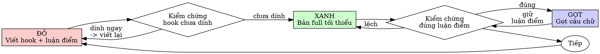

# Phát Triển Theo Hook (Hook-First)

## Tổng quan

Chốt hook + luận điểm chính trước. Kiểm chứng hook có "dính" không. Rồi mới viết bản full.

**Nguyên tắc cốt lõi:** Nếu bạn chưa kiểm chứng hook có giữ được người xem không, bạn không biết hook đó có đáng viết tiếp hay không.

**Vi phạm chữ của luật là vi phạm tinh thần của luật.**

## Khi nào dùng

**Luôn dùng cho:**
- Bài viết / video mới
- Viết lại bài flop
- Chỉnh sửa lớn (đổi góc nhìn, đổi cấu trúc)

**Ngoại lệ (hỏi bạn trước):**
- Nháp thăm dò nhanh (viết chơi, không định đăng)
- Repost / đăng lại nguyên văn bài cũ

Nghĩ "bỏ qua hook-first chỉ lần này thôi"? Dừng lại. Đó là tự ngụy biện.

## Luật sắt

```
KHÔNG VIẾT FULL BÀI KHI CHƯA CHỐT HOOK
```

Viết full bài trước khi chốt hook? Xóa bản full. Bắt đầu lại từ hook.

**Không ngoại lệ:**
- Không giữ làm "tham khảo"
- Không "tận dụng" ý nào trong đó
- Không đọc lại nó
- Xóa là xóa

Viết mới hoàn toàn từ hook đã chốt. Chấm hết.

## Đỏ-Xanh-Gọt



### ĐỎ — Viết hook + luận điểm chính

Viết một hook (câu mở đầu / tiêu đề) + 3 gạch đầu dòng luận điểm chính. Không viết gì thêm.

<Good>
```
Hook: "Tôi đã bỏ 2 triệu học khóa content, và điều đáng giá nhất chỉ gói gọn trong 1 câu."
- Luận điểm 1: Người xem quyết định ở lại hay lướt qua trong 3 giây đầu
- Luận điểm 2: Hook tốt = hứa hẹn 1 giá trị cụ thể, không hứa chung chung
- Luận điểm 3: Cách test hook: đọc to, hỏi "người lướt feed có dừng lại không?"
```
Hook cụ thể, khơi tò mò, hứa hẹn 1 giá trị rõ ràng
</Good>

<Bad>
```
Hook: "Bạn có biết content hay bắt đầu từ đâu không?"
- Luận điểm 1: Content rất quan trọng
- Luận điểm 2: Cần đầu tư vào content
- Luận điểm 3: Ai cũng nên học làm content
```
Hook chung chung kiểu "Bạn có biết...", luận điểm sáo rỗng, không hứa hẹn gì cụ thể
</Bad>

**Yêu cầu:**
- Một hook duy nhất
- Hook cụ thể, không chung chung
- 3 luận điểm là xương sống của bài, không phải ý trang trí

### Kiểm chứng ĐỎ — Hook phải "fail" đúng cách

**BẮT BUỘC. Không bao giờ được bỏ qua.**

Đọc to hook, tự hỏi: "Người đang lướt feed có dừng lại không?"

Xác nhận:
- Hook CHƯA đủ dính (chưa đủ tò mò, hoặc chưa rõ giá trị hứa hẹn)
- Bạn nhận ra được điểm yếu cụ thể của hook (chứ không phải "nghe chưa hay" chung chung)
- Hook yếu vì chưa chốt, không phải vì bạn viết ẩu

**Hook đã "dính" ngay từ lần đầu?** Nghĩa là bạn đang tự dối mình — viết lại một hook khác khó hơn, gai góc hơn.

**Không chỉ ra được điểm yếu?** Đọc to lần nữa, chậm hơn. Vẫn không thấy? Nhờ bạn đọc và nhận xét.

### XANH — Viết bản full tối thiểu

Viết bản full đủ để truyền tải 3 luận điểm đã chốt. Chỉ vậy thôi.

<Good>
```
Mở bằng hook đã chốt. Mỗi luận điểm 1 đoạn ngắn, 1 ví dụ thật.
Kết bằng 1 câu chốt lại giá trị người đọc nhận được.
```
Đủ để truyền tải luận điểm, không thêm mục mới
</Good>

<Bad>
```
Mở bằng hook đã chốt. Thêm 2 luận điểm mới nảy ra lúc viết.
Mở rộng mỗi ý thành 3 đoạn, chèn thêm câu chuyện cá nhân dài,
kết bằng 3 lời kêu gọi hành động khác nhau.
```
Tham lam: thêm ý mới, "trau chuốt" quá đà, lạc khỏi luận điểm đã chốt
</Bad>

Không thêm luận điểm mới, không mở rộng phạm vi, không "trau chuốt" quá đà.

### Kiểm chứng XANH — Đọc lại một lượt

**BẮT BUỘC.**

Đọc lại toàn bộ bản full một lượt, xác nhận:
- Hook mở đầu còn giữ nguyên (không bị "gọt" mất lúc viết)
- 3 luận điểm đều có mặt, không thêm ý lạ
- Chính tả, dấu câu ổn

**Hook bị biến dạng?** Khôi phục hook đã chốt, không "cải tiến" nó lúc này.

**Xuất hiện luận điểm thứ 4?** Cắt bỏ. Nó thuộc về bài khác.

**"Đọc lại toàn bộ" nghĩa là bản nháp cuối cùng, không phải bản trong đầu bạn.** Đọc lướt qua rồi tuyên bố "ổn" là tự lừa mình. Trước khi tuyên bố xong, dùng skill `superpowers:verification-before-completion`.

### GỌT — Chỉ sau khi xanh

Chỉ sau khi bản full đã đúng luận điểm mới được:
- Gọt câu chữ cho mượt
- Cắt câu thừa
- Thêm ví dụ minh họa

Giữ luận điểm nguyên vẹn. Không thêm ý mới lúc gọt.

### Lặp lại

Hook + luận điểm tiếp theo cho bài tiếp theo.

## Hook tốt

| Tiêu chí | Tốt | Tệ |
|----------|-----|-----|
| **Cụ thể** | Một giá trị, một con số, một tình huống thật | "Bạn có biết...", "Ai cũng nên...", "Điều quan trọng là..." |
| **Khơi tò mò** | Người đọc phải đọc tiếp mới biết đáp án | Nói hết đáp án ngay trong hook |
| **Hứa 1 giá trị** | Đọc xong người ta biết mình được gì | Hứa chung chung, đọc xong chẳng nhớ gì |

Khi viết hoặc sửa bất kỳ hook nào, đọc [writing-good-tests.md](writing-good-tests.md) để giữ hook trung thực:
- Gọi tên 1 thay đổi cụ thể ở người đọc trước khi viết hook
- Hứa hẹn điều bài viết thật sự delivers, không câu view
- Giữ phần "thử nghiệm" trong bản nháp, ngoài bản đăng
- Hiểu nền tảng trước khi viết hook theo trend của nó

## Những lời ngụy biện thường gặp

| Ngụy biện | Sự thật |
|-----------|---------|
| "Viết luôn cho nhanh rồi sửa hook sau" | Hook viết sau bị thiên vị bởi bài bạn đã viết — bạn sẽ chọn hook "hợp với bài" thay vì hook "dính với người đọc". Bạn chưa bao giờ kiểm chứng hook độc lập, nên không chứng minh được nó giữ chân ai. Chốt hook trước ép bạn trả lời câu hỏi khó nhất trước. |
| "Tôi viết nhiều nên biết hook nào dính" | Kinh nghiệm không thay bằng chứng. Hook bạn "cảm thấy dính" vẫn cần qua bài kiểm chứng đọc-to. Cảm giác đã lừa nhiều người viết lâu năm. |
| "Xóa bản full thì phí công" | Ngụy biện chi phí chìm — công đã bỏ ra mất rồi dù giữ hay xóa. Lựa chọn thật sự: viết lại từ hook đã chốt (tự tin cao) hay giữ bản full viết vội rồi vá hook (tự tin thấp, dễ flop). Giữ bản nháp mà hook chưa chốt mới là phí công. |
| "Giữ bản full làm tham khảo, chốt hook trước" | Bạn sẽ tận dụng nó. Đó chính là viết full trước. Xóa là xóa. |
| "Ý tưởng đơn giản, không cần chốt hook" | Bài đơn giản vẫn flop vì hook nhạt. Chốt hook mất 5 phút. |
| "Cần viết thử mới biết bài đi về đâu" | Được. Viết thử xong thì xóa, bắt đầu lại từ hook. Bản thử là nháp thăm dò, không phải bản chính. |
| "Hook khó = chủ đề khó" | Nghe theo hook. Khó chốt hook = chưa rõ mình muốn nói gì. Làm rõ luận điểm trước. |
| "Hook-first làm tôi chậm" | Hook-first LÀ con đường thực tế: bắt lỗi ngay ở hook thay vì viết xong 1000 chữ mới phát hiện bài không ai đọc. "Thực tế" kiểu viết luôn là đăng bài flop rồi sửa — chậm hơn, không nhanh hơn. |
| "Tôi đọc lại trong đầu là đủ" | Đọc trong đầu là tùy hứng: không có bản ghi, không đọc lại được khi sửa bài, dễ bỏ sót dưới áp lực. "Thấy ổn lúc nghĩ" ≠ hook dính. Đọc to thành tiếng mới tính. |
| "Bài cũ không có hook vẫn lên" | Bài cũ lên vì may mắn hoặc nền tảng khác. Bạn đang viết bài này, chốt hook cho bài này. |

## Red Flags - DỪNG LẠI và bắt đầu lại

- Viết full trước khi chốt hook
- Chốt hook sau khi viết xong bài
- Hook "dính" ngay lần đầu mà không qua kiểm chứng
- Không giải thích được hook yếu ở điểm nào
- Hook được thêm "sau"
- Tự nhủ "chỉ lần này thôi"
- "Tôi đọc trong đầu là đủ"
- "Viết luôn rồi sửa hook sau cũng vậy"
- "Quan trọng là tinh thần, không phải nghi thức"
- "Giữ bản full làm tham khảo" hoặc "tận dụng ý trong đó"
- "Viết mất mấy tiếng rồi, xóa thì phí"
- "Hook-first là giáo điều, tôi thực tế hơn"
- "Bài này khác vì..."

**Tất cả những dấu hiệu trên đều có nghĩa: Xóa bản full. Bắt đầu lại từ hook.**

## Ví dụ: Viết lại bài flop

**Bài flop:** Bài "5 mẹo tiết kiệm" reach thấp, người xem thoát ở 3 giây đầu

**ĐỎ**
```
Hook: "Tháng trước tôi suýt cháy túi vì 1 thói quen tốn 37 nghìn mỗi ngày mà không hay biết."
- Luận điểm 1: Tiền rò rỉ qua thói quen nhỏ, không qua khoản chi lớn
- Luận điểm 2: Cách tìm "lỗ rò": ghi lại mọi khoản chi dưới 50 nghìn trong 7 ngày
- Luận điểm 3: Bịt 1 lỗ rò = tiết kiệm hơn cắt 1 khoản chi lớn
```

**Kiểm chứng ĐỎ**
Đọc to: "Người lướt feed có dừng lại không?" → Chưa. "37 nghìn mỗi ngày" chưa đủ sốc, "suýt cháy túi" hơi cường điệu. Viết lại hook khác khó hơn.

**XANH**
Viết bản full tối thiểu: mở bằng hook mới, mỗi luận điểm 1 đoạn + 1 ví dụ thật, 1 câu chốt.

**Kiểm chứng XANH**
Đọc lại một lượt: hook còn nguyên? 3 luận điểm đủ? chính tả ổn?

**GỌT**
Cắt câu thừa, gọt câu chữ, thêm ví dụ minh họa cho luận điểm 2.

## Checklist kiểm chứng

Trước khi coi như xong:

- [ ] Mọi bài mới đều có hook được chốt trước
- [ ] Đã đọc to hook và thấy nó chưa đủ dính trước khi viết full
- [ ] Chỉ ra được điểm yếu cụ thể của hook (không phải "nghe chưa hay" chung chung)
- [ ] Bản full chỉ truyền tải đúng luận điểm đã chốt
- [ ] Không thêm luận điểm mới lúc viết full
- [ ] Đọc lại toàn bộ bản cuối một lượt
- [ ] Hook mở đầu còn nguyên vẹn
- [ ] Chính tả, dấu câu ổn

Không tick được hết? Bạn đã bỏ qua hook-first. Bắt đầu lại.

## Khi bị kẹt

| Vấn đề | Cách gỡ |
|--------|---------|
| Không biết viết hook | Viết điều người đọc mong nhận được. Viết câu hứa hẹn trước. Hỏi bạn. |
| Hook quá phức tạp | Luận điểm quá phức tạp. Đơn giản hóa điều muốn nói. |
| Phải nhồi quá nhiều vào hook | Bài đang ôm đồm. Tách thành 2 bài. |
| Viết hook mất quá lâu | Ghi nhanh 5 hook tệ trước. Vẫn kẹt? Luận điểm chưa rõ. |

## Tích hợp chẩn đoán

Bài flop? Viết hook + luận điểm mới chốt lại nó. Theo chu trình hook-first. Hook mới là bằng chứng của cách viết lại và ngăn bài flop tiếp.

Không viết lại bài flop mà không chốt hook trước.

## Luật cuối

```
Bản full → hook đã chốt và đã qua kiểm chứng trước
Ngược lại → không phải hook-first
```

Không ngoại lệ nếu bạn chưa đồng ý.
