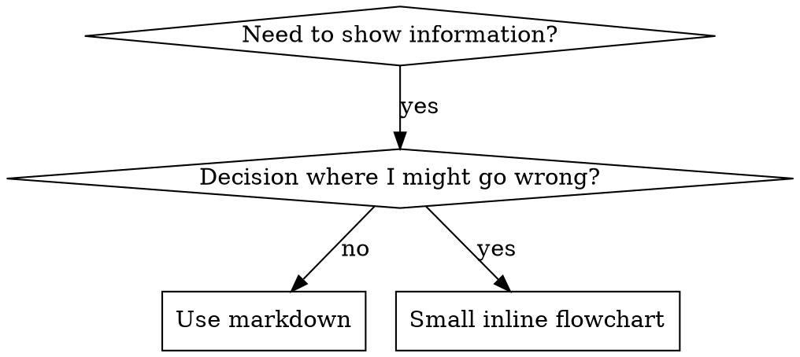

# Writing Skills

## Overview

**Viết skill CHÍNH LÀ Hook-first áp dụng cho tài liệu quy trình.**

**Personal skills nằm trong thư mục skills của runtime** (`~/.claude/skills/` trên Claude Code) — xem [codex-tools.md](../using-superpowers/references/codex-tools.md) hoặc [gemini-tools.md](../using-superpowers/references/gemini-tools.md) cho đường dẫn trên các runtime khác. Codex, Copilot CLI và Gemini CLI đều nhận `~/.agents/skills/` làm alias dùng chung.

Bạn viết test case (tình huống gây áp lực với subagent), xem chúng thất bại (baseline), viết skill (tài liệu), xem test pass (agent tuân thủ), rồi refactor (bịt lỗ hổng).

**Core principle:** Nếu bạn chưa từng thấy agent vi phạm khi KHÔNG có skill, bạn không biết skill có dạy đúng thứ cần dạy không.

**REQUIRED BACKGROUND:** Bạn PHẢI hiểu superpowers:test-driven-development (bản hook-first) trước khi dùng skill này. Skill đó định nghĩa chu trình RED-GREEN-REFACTOR cơ bản. Skill này áp dụng TDD cho tài liệu.

**Official guidance:** Về best practices viết skill chính thức của Anthropic, xem anthropic-best-practices.md. Tài liệu này bổ sung các pattern và hướng dẫn đi kèm cách tiếp cận TDD-first.

## What is a Skill?

Một **skill** là tài liệu tham khảo cho kỹ thuật, pattern hoặc công cụ đã được chứng minh. Skill giúp các agent trong tương lai tìm và áp dụng cách làm hiệu quả.

**Skill là:** Kỹ thuật tái dùng, pattern, công cụ, tài liệu tham khảo

**Skill KHÔNG phải:** Câu chuyện kể lại một lần bạn giải quyết vấn đề

## TDD Mapping for Skills

| Khái niệm TDD | Viết skill |
|-------------|-----------|
| **Test case** | Tình huống gây áp lực với subagent (vd: dí deadline + bài đã viết 2 tiếng) |
| **Production code** | Tài liệu skill (SKILL.md) |
| **Test fails (ĐỎ)** | Agent vi phạm quy tắc khi chưa có skill (ghi lại baseline) |
| **Test passes (XANH)** | Agent tuân thủ khi có skill |
| **Refactor** | Bịt lỗ hổng mới phát hiện |
| **Viết test trước** | Chạy baseline scenario TRƯỚC KHI viết skill |
| **Xem nó fail** | Ghi lại đúng lời biện minh agent dùng |
| **Code tối thiểu** | Viết skill nhắm đúng các vi phạm đó |
| **Xem nó pass** | Xác minh agent giờ tuân thủ |
| **Chu trình refactor** | Tìm biện minh mới → bịt → kiểm chứng lại |

Toàn bộ quá trình tạo skill tuân theo RED-GREEN-REFACTOR.

## When to Create a Skill

**Tạo khi:**
- Kỹ thuật không hiển nhiên trực giác với bạn
- Bạn sẽ tham khảo lại ở nhiều dự án content
- Pattern áp dụng rộng (không riêng một dự án)
- Người khác cũng hưởng lợi

**Đừng tạo cho:**
- Mẹo một lần
- Kiến thức phổ thông đã có tài liệu đầy đủ
- Quy ước riêng của 1 dự án (để vào file instructions của dự án)
- Ràng buộc cơ học (nếu kiểm tra được bằng regex/validation thì tự động hóa — dành tài liệu cho các quyết định cần phán đoán)

## Skill Types

### Technique
Phương pháp cụ thể có các bước làm theo (kỹ thuật viết hook, kiểm chứng fact trước khi đăng)

### Pattern
Cách tư duy về vấn đề (pattern chẩn đoán bài flop, cấu trúc bài viral)

### Reference
Tài liệu API, hướng dẫn cú pháp, tài liệu công cụ (bảng tone-of-voice, danh sách CTA mẫu)

## Directory Structure


```
skills/
  skill-name/
    SKILL.md              # Tham khảo chính (bắt buộc)
    supporting-file.*     # Chỉ khi cần
```

**Namespace phẳng** - tất cả skill trong một namespace tìm kiếm được

**Tách file riêng cho:**
1. **Tài liệu tham khảo nặng** (100+ dòng) - bảng tone, thư viện hook mẫu
2. **Công cụ tái dùng** - Script, tiện ích, template

**Giữ inline:**
- Nguyên tắc và khái niệm
- Pattern content (< 50 dòng)
- Mọi thứ còn lại

## SKILL.md Structure

**Frontmatter (YAML):**
- Hai trường bắt buộc: `name` và `description` (xem [agentskills.io/specification](https://agentskills.io/specification) cho tất cả trường hỗ trợ)
- Tối đa 1024 ký tự
- `name`: Chỉ dùng chữ cái, số và gạch ngang (không ngoặc, không ký tự đặc biệt)
- `description`: Ngôi thứ ba, mô tả CHỈ KHI NÀO dùng (KHÔNG tóm tắt quy trình)
  - Bắt đầu bằng "Dùng khi..." để tập trung vào điều kiện kích hoạt
  - Bao gồm triệu chứng, tình huống và ngữ cảnh cụ thể
  - **KHÔNG BAO GIỜ tóm tắt quy trình/workflow của skill** (xem mục SDO để biết vì sao)
  - Dưới 500 ký tự nếu có thể

```markdown
---
name: Skill-Name-With-Hyphens
description: Dùng khi [điều kiện kích hoạt và triệu chứng cụ thể]
---

# Skill Name

## Overview
Đây là gì? Core principle trong 1-2 câu.

## When to Use
[Sơ đồ quyết định inline nhỏ NẾU việc quyết định không hiển nhiên]

Danh sách bullet gồm TRIỆU CHỨNG và use case
Khi nào KHÔNG dùng

## Core Pattern (cho technique/pattern)
So sánh trước/sau bằng ví dụ content

## Quick Reference
Bảng hoặc bullet để quét nhanh các thao tác thường dùng

## Implementation
Ví dụ content inline cho pattern đơn giản
Link tới file riêng cho tài liệu nặng hoặc công cụ tái dùng

## Common Mistakes
Cái gì hay sai + cách sửa

## Real-World Impact (tùy chọn)
Kết quả cụ thể
```


## Skill Discovery Optimization (SDO)

**Quan trọng cho discovery:** Các agent trong tương lai cần TÌM được skill của bạn

### 1. Rich Description Field

**Mục đích:** Agent đọc description để quyết định có load skill cho task hiện tại không. Nó phải trả lời: "Tôi có nên đọc skill này ngay không?"

**Format:** Bắt đầu bằng "Dùng khi..." để tập trung vào điều kiện kích hoạt

**CRITICAL: Description = Khi nào dùng, KHÔNG phải Skill làm gì**

Description chỉ mô tả điều kiện kích hoạt. KHÔNG tóm tắt quy trình/workflow của skill trong description.

**Vì sao quan trọng:** Thử nghiệm cho thấy khi description tóm tắt workflow, agent có thể làm theo description thay vì đọc toàn bộ skill. Một description ghi "review bài giữa các task" khiến agent chỉ review MỘT lần, dù flowchart trong skill ghi rõ HAI lần review (đối chiếu brief trước, rồi chất lượng bài).

Khi description đổi thành chỉ "Dùng khi chạy kế hoạch content với các task độc lập" (không tóm tắt workflow), agent đã đọc flowchart và làm đúng quy trình hai bước.

**Cái bẫy:** Description tóm tắt workflow tạo lối tắt mà agent sẽ đi. Thân skill trở thành tài liệu bị bỏ qua.

```yaml
# ❌ SAI: Tóm tắt workflow - agent có thể làm theo cái này thay vì đọc skill
description: Dùng khi chạy kế hoạch - dispatch subagent cho mỗi task kèm review bài giữa các task

# ❌ SAI: Quá nhiều chi tiết quy trình
description: Dùng cho kiểm chứng - đọc thử trước, check fact, đọc to thành tiếng, sửa, đăng

# ✅ ĐÚNG: Chỉ điều kiện kích hoạt, không tóm tắt workflow
description: Dùng khi chạy kế hoạch content với các task độc lập trong session hiện tại

# ✅ ĐÚNG: Chỉ điều kiện kích hoạt
description: Dùng khi viết bài mới hoặc sửa bài, trước khi đăng
```

**Content:**
- Dùng trigger, triệu chứng và tình huống cụ thể báo hiệu skill áp dụng
- Mô tả *vấn đề* (bài flop, hook yếu) chứ không phải *triệu chứng riêng nền tảng* (reach Facebook, view TikTok)
- Giữ trigger độc lập nền tảng trừ khi skill vốn riêng cho nền tảng đó
- Nếu skill riêng cho nền tảng, nêu rõ trong trigger
- Viết ngôi thứ ba (được inject vào system prompt)
- **KHÔNG BAO GIỜ tóm tắt quy trình/workflow của skill**

```yaml
# ❌ SAI: Quá trừu tượng, mơ hồ, không nêu khi nào dùng
description: Cho việc viết hook

# ❌ SAI: Ngôi thứ nhất
description: Tôi có thể giúp bạn viết hook khi bài bị flop

# ❌ SAI: Nhắc nền tảng nhưng skill không riêng nền tảng đó
description: Dùng khi bài Facebook bị flop reach

# ✅ ĐÚNG: Bắt đầu bằng "Dùng khi", mô tả vấn đề, không tóm tắt workflow
description: Dùng khi hook bài yếu, độc giả rời đi trong 3 giây đầu, hoặc bài flop dù nội dung tốt

# ✅ ĐÚNG: Skill riêng nền tảng với trigger rõ ràng
description: Dùng khi viết kịch bản video dọc 9:16 và cần giữ người xem qua 3 giây đầu
```

### 2. Keyword Coverage

Dùng từ mà agent sẽ tìm kiếm:
- Triệu chứng: "bài flop", "hook yếu", "lệch tone", "sai fact", "bí ý tưởng"
- Vấn đề: "đăng xong không ai đọc", "viết lại 3 lần vẫn chưa ưng"
- Từ đồng nghĩa: "flop/chìm/không reach", "brief/kế hoạch content/yêu cầu bài"
- Công cụ: Tên định dạng, loại content, tên file

### 3. Descriptive Naming

**Dùng thể chủ động, động từ đứng đầu:**
- ✅ `creating-skills` không phải `skill-creation`
- ✅ `writing-hooks` không phải `hook-helpers`

### 4. Token Efficiency (Critical)

**Vấn đề:** các skill getting-started và skill được tham chiếu thường xuyên load vào MỌI conversation. Mỗi token đều quý.

**Mục tiêu số từ:**
- Workflow getting-started: <150 từ mỗi cái
- Skill load thường xuyên: <200 từ tổng
- Skill khác: <500 từ (vẫn phải gọn)

**Kỹ thuật:**

**Chuyển chi tiết sang tool help:**
```bash
# ❌ SAI: Ghi hết flag trong SKILL.md
render-video hỗ trợ --hook, --caption, --cta, --format 9:16

# ✅ ĐÚNG: Tham chiếu --help
render-video hỗ trợ nhiều chế độ và tùy chọn. Chạy --help để xem chi tiết.
```

**Dùng cross-reference:**
```markdown
# ❌ SAI: Lặp lại chi tiết workflow
Khi tìm kiếm, dispatch subagent kèm template...
[20 dòng lặp lại hướng dẫn]

# ✅ ĐÚNG: Tham chiếu skill khác
Luôn dùng subagent (tiết kiệm ngữ cảnh 50-100x). BẮT BUỘC: Dùng [tên-skill-khác] cho workflow.
```

**Nén ví dụ:**
```markdown
# ❌ SAI: Ví dụ dài dòng (42 từ)
bạn: "Lần trước mình viết hook cho bài về người ái kỷ thế nào nhỉ?"
Bạn: Để mình tìm trong các conversation cũ pattern viết hook về người ái kỷ.
[Dispatch subagent với câu truy vấn: "pattern viết hook về người ái kỷ"]

# ✅ ĐÚNG: Ví dụ tối giản (20 từ)
Bạn: "Hook bài ái kỷ lần trước viết sao?"
Tôi: Đang tìm...
[Dispatch subagent → tổng hợp]
```

**Loại bỏ trùng lặp:**
- Đừng lặp lại nội dung đã có trong skill cross-referenced
- Đừng giải thích cái hiển nhiên từ câu chữ
- Đừng đưa nhiều ví dụ cho cùng một pattern

**Kiểm chứng:**
```bash
wc -w skills/path/SKILL.md
# workflow getting-started: nhắm <150 mỗi cái
# skill load thường xuyên: nhắm <200 tổng
```

**Đặt tên theo việc bạn LÀM hoặc insight cốt lõi:**
- ✅ `writing-hooks` > `hook-helpers`
- ✅ `diagnosing-flops` > `debugging-techniques`

**Danh động từ (-ing) hợp với quy trình:**
- `creating-skills`, `testing-skills`, `reviewing-drafts`
- Chủ động, mô tả hành động đang làm

### 5. Cross-Referencing Other Skills

**Khi viết tài liệu tham chiếu skill khác:**

Chỉ dùng tên skill, kèm marker yêu cầu rõ ràng:
- ✅ Đúng: `**REQUIRED SUB-SKILL:** Dùng superpowers:test-driven-development`
- ✅ Đúng: `**REQUIRED BACKGROUND:** Bạn PHẢI hiểu superpowers:systematic-debugging`
- ❌ Sai: `Xem skills/testing/test-driven-development` (không rõ có bắt buộc không)
- ❌ Sai: `@skills/testing/test-driven-development/SKILL.md` (force-load, đốt ngữ cảnh)

**Vì sao không dùng @ link:** Cú pháp `@` force-load file ngay lập tức, tiêu tốn 200k+ ngữ cảnh trước khi bạn cần.

## Flowchart Usage



**Chỉ dùng flowchart cho:**
- Điểm quyết định không hiển nhiên
- Vòng lặp quy trình mà bạn có thể dừng quá sớm
- Quyết định "khi nào dùng A vs B"

**Không bao giờ dùng flowchart cho:**
- Tài liệu tham khảo → Bảng, danh sách
- Ví dụ content → Khối Markdown
- Hướng dẫn tuyến tính → Danh sách số
- Nhãn không có nghĩa ngữ nghĩa (step1, helper2)

Xem `graphviz-conventions.dot` trong thư mục này cho quy tắc style graphviz.

**Trực quan hóa cho bạn:** Dùng `render-graphs.js` trong thư mục này để render flowchart của skill ra SVG:
```bash
node ./render-graphs.js ../some-skill           # Từng diagram riêng
node ./render-graphs.js ../some-skill --combine # Tất cả diagram trong một SVG
```

## Ví dụ content

**Một ví dụ xuất sắc hơn nhiều ví dụ tầm thường**

Chọn ví dụ phù hợp nhất:
- Kỹ thuật kiểm chứng → đoạn bản nháp + cách đọc kiểm chứng
- Kỹ thuật viết hook → hook thật từ bài đã đăng
- Cấu trúc bài → outline bài thật

**Ví dụ tốt:**
- Hoàn chỉnh, dùng được ngay
- Có chú thích giải thích TẠI SAO
- Từ tình huống thật
- Thể hiện pattern rõ ràng
- Sẵn sàng để áp dụng (không phải template điền chỗ trống)

**Đừng:**
- Viết ví dụ cho 5+ nền tảng
- Tạo template điền-chỗ-trống
- Viết ví dụ gượng ép

Bạn giỏi chuyển thể - một ví dụ hay là đủ.

## File Organization

### Self-Contained Skill
```
defense-in-depth/
  SKILL.md    # Mọi thứ inline
```
Khi: Mọi nội dung vừa, không cần tài liệu nặng

### Skill với công cụ tái dùng
```
writing-hooks/
  SKILL.md    # Tổng quan + pattern
  hook-bank.md  # Ngân hàng hook mẫu để áp dụng
```
Khi: Công cụ là tài liệu tái dùng, không chỉ là câu chuyện

### Skill với tài liệu tham khảo nặng
```
tone-of-voice/
  SKILL.md       # Tổng quan + workflow
  tone-guide.md  # 600 dòng hướng dẫn tone chi tiết
  cta-bank.md    # 500 dòng mẫu CTA
  scripts/       # Công cụ chạy được
```
Khi: Tài liệu tham khảo quá lớn để inline

Gọi script đóng gói qua interpreter trong văn bản (`bash scripts/tool.sh`, `node scripts/tool.js`), không gọi bằng bare path: một số harness đóng gói plugin strip mất executable bit, và bare `scripts/tool.sh` sẽ lỗi `Permission denied` ở đó.

## The Iron Law (Same as TDD)

```
NO SKILL WITHOUT A FAILING TEST FIRST
```

Áp dụng cho skill MỚI VÀ SỬA skill cũ.

Viết skill trước khi test? Xóa đi. Bắt đầu lại.
Sửa skill mà không test? Vi phạm tương tự.

**Không ngoại lệ:**
- Không cho "chỉ thêm một mục nhỏ"
- Không cho "chỉ thêm một section"
- Không cho "chỉ cập nhật tài liệu"
- Đừng giữ thay đổi chưa test làm "tham khảo"
- Đừng "vừa chạy test vừa sửa"
- Xóa là xóa

**REQUIRED BACKGROUND:** Skill superpowers:test-driven-development giải thích vì sao việc này quan trọng. Cùng nguyên tắc áp dụng cho tài liệu.

## Testing All Skill Types

Các loại skill cần cách test khác nhau:

### Discipline-Enforcing Skills (quy tắc/yêu cầu)

**Ví dụ:** kiểm chứng trước khi đăng, xác minh trước khi hoàn thành, lập brief trước khi viết

**Test bằng:**
- Câu hỏi học thuật: Họ có hiểu quy tắc không?
- Tình huống áp lực: Họ có tuân thủ khi bị dí không?
- Nhiều áp lực kết hợp: deadline + công sức đã bỏ + mệt mỏi
- Nhận diện biện minh và thêm counter rõ ràng

**Tiêu chí thành công:** Agent tuân thủ quy tắc dưới áp lực tối đa

### Technique Skills (hướng dẫn cách làm)

**Ví dụ:** kỹ thuật viết hook, kỹ thuật kiểm chứng fact, kiểm chứng đọc to

**Test bằng:**
- Tình huống áp dụng: Họ áp dụng kỹ thuật đúng không?
- Tình huống biến thể: Họ xử lý case biên thế nào?
- Test thiếu thông tin: Hướng dẫn có lỗ hổng không?

**Tiêu chí thành công:** Agent áp dụng thành công kỹ thuật cho tình huống mới

### Pattern Skills (mô hình tư duy)

**Ví dụ:** pattern chẩn đoán bài flop, mô hình cấu trúc bài viral

**Test bằng:**
- Tình huống nhận diện: Họ có nhận ra khi nào pattern áp dụng không?
- Tình huống áp dụng: Họ có dùng được mô hình tư duy không?
- Counter-example: Họ có biết khi nào KHÔNG áp dụng không?

**Tiêu chí thành công:** Agent nhận diện đúng khi nào/cách nào áp dụng pattern

### Reference Skills (tài liệu/API)

**Ví dụ:** bảng tone-of-voice, ngân hàng CTA, hướng dẫn định dạng nền tảng

**Test bằng:**
- Tình huống tra cứu: Họ tìm đúng thông tin không?
- Tình huống áp dụng: Họ dùng đúng thứ tìm được không?
- Test lỗ hổng: Các use case phổ biến đã được bao phủ chưa?

**Tiêu chí thành công:** Agent tìm và áp dụng đúng thông tin tham khảo

## Common Rationalizations for Skipping Testing

| Excuse | Reality |
|--------|---------|
| "Skill rõ ràng quá rồi" | Rõ với bạn ≠ rõ với agent khác. Test đi. |
| "Chỉ là tài liệu tham khảo" | Tài liệu tham khảo cũng có lỗ hổng, mục khó hiểu. Test khả năng tra cứu. |
| "Test là thừa" | Skill chưa test luôn có vấn đề. Luôn luôn. 15 phút test tiết kiệm hàng giờ. |
| "Có vấn đề thì test sau" | Vấn đề = agent không dùng được skill. Test TRƯỚC khi triển khai. |
| "Test mệt quá" | Test đỡ mệt hơn debug skill lỗi khi đã đưa vào dùng. |
| "Tôi chắc là nó ổn" | Tự tin thái quá đảm bảo có vấn đề. Cứ test. |
| "Review học thuật là đủ" | Đọc ≠ dùng. Test tình huống áp dụng. |
| "Không có thời gian test" | Triển khai skill chưa test tốn nhiều thời gian sửa hơn. |

**Tất cả những cái này nghĩa là: Test trước khi triển khai. Không ngoại lệ.**

## Match the Form to the Failure

Trước khi viết hướng dẫn, phân loại thất bại baseline. Form bịt đúng một loại thất bại sẽ phản tác dụng rõ rệt với loại khác.

| Baseline failure | Form đúng | Form sai |
|---|---|---|
| Bỏ qua/vi phạm quy tắc dưới áp lực (biết mà vẫn làm) | Cấm + bảng biện minh + red flags (xem Bulletproofing bên dưới) | Hướng dẫn mềm ("nên...", "cân nhắc...") |
| Tuân thủ, nhưng output sai hình dạng (brief phình to, kết luận bị chôn, diễn giải lại brief) | Công thức tích cực hoặc contract: nêu output LÀ gì — các phần của nó, theo thứ tự | Danh sách cấm ("đừng diễn giải", "không kể lể") |
| Thiếu một phần bắt buộc trong thứ họ đã sản xuất | Cấu trúc: trường REQUIRED hoặc slot trong template họ điền | Nhắc nhở bằng văn xuôi gần template |
| Hành vi nên phụ thuộc điều kiện | Điều kiện gắn với predicate quan sát được ("nếu brief tồn tại, tham chiếu nó") | Quy tắc tuyệt đối + mệnh đề miễn trừ |

**Vì sao cấm đoán phản tác dụng với bài toán tạo hình:** dưới động lực cạnh tranh ("làm cho brief tự đầy đủ"), agent mặc cả với "đừng X". Trong test đối đầu cách diễn đạt cho hướng dẫn dispatch-prompt, nhóm dùng cấm đoán cho ra nhiều nội dung không mong muốn hơn rõ rệt so với nhóm dùng công thức (phân phối tách hẳn), và còn tệ hơn cả nhóm không hướng dẫn — hãy micro-test case của chính bạn thay vì mặc định, nhưng đừng bao giờ với tay lấy cấm đoán trước. Công thức không có gì để mặc cả: output khớp hình dạng đã nêu hoặc không.

**Quy tắc cho form nào bạn chọn:**
- **Không mệnh đề sắc thái.** "Đừng X trừ khi quan trọng" mở lại cuộc mặc cả — thêm một mệnh đề sắc thái vào công thức đang thắng làm nó từ ổn định thành nhiễu trong cùng test diễn đạt. Diễn đạt ngoại lệ thật sự thành điều kiện riêng gắn với predicate quan sát được.
- **Mệnh đề miễn trừ không giới hạn phạm vi.** "Giới hạn này không áp dụng cho khối ví dụ" vẫn đè nén khối ví dụ. Nếu một phần output phải được miễn, cấu trúc lại để quy tắc không chạm tới nó.

## Bulletproofing Skills Against Rationalization

Skill ép kỷ luật (như kiểm chứng trước khi đăng) cần chống biện minh. Agent thông minh và sẽ tìm lỗ hổng khi bị dí.

**Phạm vi:** toolkit này dành cho thất bại kỷ luật — agent biết quy tắc mà bỏ qua dưới áp lực. Với output sai hình dạng hoặc thiếu phần, bulletproofing kiểu cấm đoán phản tác dụng; dùng các form trong Match the Form to the Failure.

**Ghi chú tâm lý:** Hiểu TẠI SAO kỹ thuật thuyết phục hiệu quả giúp bạn áp dụng có hệ thống. Xem persuasion-principles.md cho nền tảng nghiên cứu (Cialdini, 2021; Meincke et al., 2025) về thẩm quyền, cam kết, khan hiếm, bằng chứng xã hội và thống nhất.

### Close Every Loophole Explicitly

Đừng chỉ nêu quy tắc - cấm luôn các đường vòng cụ thể:

<Bad>
```markdown
Viết bài trước khi kiểm chứng? Xóa đi.
```
</Bad>

<Good>
```markdown
Viết bài trước khi kiểm chứng? Xóa đi. Bắt đầu lại.

**Không ngoại lệ:**
- Đừng giữ làm "tham khảo"
- Đừng "sửa dần" trong lúc kiểm chứng
- Đừng nhìn vào nó
- Xóa là xóa
```
</Good>

### Address "Spirit vs Letter" Arguments

Thêm nguyên tắc nền tảng ngay đầu:

```markdown
**Vi phạm chữ của quy tắc là vi phạm tinh thần của quy tắc.**
```

Câu này chặn cả một họ biện minh kiểu "tôi làm đúng tinh thần".

### Build Rationalization Table

Ghi lại biện minh từ baseline testing (xem mục Testing bên dưới). Mọi lý do agent đưa ra đều vào bảng:

```markdown
| Excuse | Reality |
|--------|---------|
| "Bài đơn giản quá, không cần kiểm chứng" | Bài đơn giản vẫn flop. Kiểm chứng mất 30 giây. |
| "Tôi kiểm chứng sau" | Kiểm chứng pass ngay chứng minh được gì đâu. |
| "Kiểm chứng sau cũng đạt mục tiêu tương tự" | Kiểm chứng sau = "bài này viết gì?" Kiểm chứng trước = "bài này nên viết gì?" |
```

### Create Red Flags List

Giúp agent tự check khi đang biện minh:

```markdown
## Red Flags - DỪNG và bắt đầu lại

- Viết bài trước khi kiểm chứng
- "Tôi đã đọc thử trong đầu rồi"
- "Kiểm chứng sau cũng đạt mục đích tương tự"
- "Quan trọng là tinh thần, không phải nghi thức"
- "Trường hợp này khác vì..."

**Tất cả những cái này nghĩa là: Xóa bản nháp. Bắt đầu lại với kiểm chứng trước.**
```

### Update SDO for Violation Symptoms

Thêm vào description: triệu chứng của việc bạn SẮP vi phạm quy tắc:

```yaml
description: dùng khi viết bài mới hoặc sửa bài, trước khi đăng
```

## RED-GREEN-REFACTOR for Skills

Tuân theo chu trình TDD:

### RED: Viết Failing Test (Baseline)

Chạy tình huống áp lực với subagent KHÔNG có skill. Ghi lại đúng hành vi:
- Họ chọn gì?
- Họ dùng biện minh nào (nguyên văn)?
- Áp lực nào kích hoạt vi phạm?

Đây là "xem test fail" - bạn phải thấy agent tự nhiên làm gì trước khi viết skill.

### GREEN: Viết Minimal Skill

Viết skill nhắm đúng các biện minh đó. Đừng thêm nội dung cho case giả định.

Chạy lại các tình huống CÓ skill. Agent giờ phải tuân thủ.

### REFACTOR: Bịt lỗ hổng

Agent tìm ra biện minh mới? Thêm counter rõ ràng. Test lại đến khi bulletproof.

### Micro-Test Wording Before Full Scenarios

Chạy pressure-scenario đầy đủ là cổng cuối, nhưng chậm và tốn kém mỗi vòng lặp. Kiểm chứng cách diễn đạt trước bằng micro-test:

1. **Một mẫu fresh-context mỗi lần gọi** — raw API call, hoặc subagent single-shot nếu không có API access. System prompt = ngữ cảnh thực tế mà hướng dẫn sẽ sống trong đó (toàn bộ skill hoặc template prompt, không phải hướng dẫn đứng một mình); user message = task cám dỗ thất bại.
2. **Luôn có no-guidance control.** Nếu control không thể hiện thất bại, chẳng có gì để sửa — dừng, đừng viết hướng dẫn.
3. **5+ reps mỗi biến thể.** Mẫu đơn lẻ nói dối.
4. **Đọc thủ công mọi match bị flag.** Chấm bằng code cũng được, nhưng template echo và counter-example bị trích dẫn giả dạng hit; đếm tự động phóng đại cả thất bại lẫn thành công.
5. **Phương sai là một metric.** Khi hướng dẫn ăn, các rep hội tụ về cùng một hình dạng. Năm cách hiểu khác nhau qua năm rep nghĩa là diễn đạt chưa ràng buộc — siết form trước khi thêm chữ.

Micro-test kiểm chứng diễn đạt; không thay thế pressure scenario cho discipline skill.

**Phương pháp test:** Xem [testing-skills-with-subagents.md](testing-skills-with-subagents.md) cho phương pháp test đầy đủ:
- Cách viết pressure scenario
- Các loại áp lực (deadline, công sức đã bỏ, thẩm quyền, kiệt sức)
- Bịt lỗ hổng có hệ thống
- Kỹ thuật meta-testing

## Anti-Patterns

### ❌ Narrative Example
"Trong session 2025-10-03, chúng tôi phát hiện bài flop vì..."
**Vì sao sai:** Quá cụ thể, không tái dùng được

### ❌ Multi-Platform Dilution
example-facebook.md, example-tiktok.md, example-youtube.md
**Vì sao sai:** Chất lượng tầm thường, gánh nặng bảo trì

### ❌ Content trong Flowcharts
```dot
step1 [label="viết hook"];
step2 [label="đọc thử"];
```
**Vì sao sai:** Không copy-paste được, khó đọc

### ❌ Generic Labels
helper1, helper2, step3, pattern4
**Vì sao sai:** Nhãn phải có nghĩa ngữ nghĩa

## STOP: Before Moving to Next Skill

**Sau khi viết BẤT KỲ skill nào, bạn PHẢI DỪNG và hoàn thành quy trình triển khai.**

**ĐỪNG:**
- Tạo nhiều skill hàng loạt mà không test từng cái
- Chuyển sang skill tiếp theo trước khi skill hiện tại được xác minh
- Bỏ test vì "làm hàng loạt hiệu quả hơn"

**Checklist triển khai bên dưới là BẮT BUỘC cho MỖI skill.**

Triển khai skill chưa test = triển khai content chưa kiểm chứng. Vi phạm tiêu chuẩn chất lượng.

## Skill Creation Checklist (TDD Adapted)

**QUAN TRỌNG: Tạo một todo cho MỖI mục checklist bên dưới.**

**RED Phase - Viết Failing Test:**
- [ ] Tạo pressure scenario (3+ áp lực kết hợp cho discipline skill)
- [ ] Chạy scenario KHÔNG có skill - ghi lại baseline behavior nguyên văn
- [ ] Nhận diện pattern trong biện minh/thất bại

**GREEN Phase - Viết Minimal Skill:**
- [ ] Tên chỉ dùng chữ cái, số, gạch ngang (không ngoặc/ký tự đặc biệt)
- [ ] YAML frontmatter với trường `name` và `description` bắt buộc (tối đa 1024 ký tự; xem [spec](https://agentskills.io/specification))
- [ ] Description bắt đầu bằng "Dùng khi..." và có trigger/triệu chứng cụ thể
- [ ] Description viết ngôi thứ ba
- [ ] Keyword xuyên suốt để tìm kiếm (triệu chứng, vấn đề, công cụ)
- [ ] Overview rõ ràng với core principle
- [ ] Nhắm đúng thất bại baseline đã xác định ở RED
- [ ] Form hướng dẫn khớp loại thất bại (xem Match the Form to the Failure)
- [ ] Với hướng dẫn tạo hình hành vi: micro-test diễn đạt với no-guidance control (5+ reps, đọc thủ công mọi flagged match) — N/A cho pure reference skill
- [ ] Ví dụ content inline HOẶC link tới file riêng
- [ ] Một ví dụ xuất sắc (không đa nền tảng)
- [ ] Chạy scenario CÓ skill - xác minh agent giờ tuân thủ

**REFACTOR Phase - Bịt lỗ hổng:**
- [ ] Nhận diện biện minh MỚI từ testing
- [ ] Thêm counter rõ ràng (nếu discipline skill)
- [ ] Xây bảng biện minh từ mọi vòng test
- [ ] Tạo danh sách red flags
- [ ] Test lại đến khi bulletproof

**Quality Checks:**
- [ ] Flowchart nhỏ chỉ khi quyết định không hiển nhiên
- [ ] Bảng quick reference
- [ ] Mục common mistakes
- [ ] Không kể chuyện narrative
- [ ] File hỗ trợ chỉ cho công cụ hoặc tài liệu nặng

**Deployment:**
- [ ] Lưu bản nháp skill vào kho content và chia sẻ với team (nếu có quy trình)
- [ ] Cân nhắc đóng góp lại cho cộng đồng (nếu hữu ích rộng)

## Discovery Workflow

Cách agent tương lai tìm skill của bạn:

1. **Gặp vấn đề** ("bài bị flop")
2. **Tìm skill** (grep description, duyệt danh mục)
3. **Tìm thấy SKILL** (description khớp)
4. **Quét overview** (có liên quan không?)
5. **Đọc pattern** (bảng quick reference)
6. **Load ví dụ** (chỉ khi áp dụng)

**Tối ưu cho flow này** - đặt từ khóa tìm kiếm sớm và thường xuyên.
